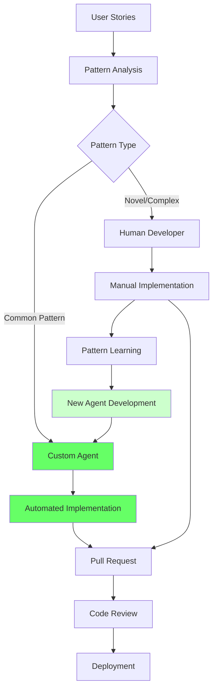
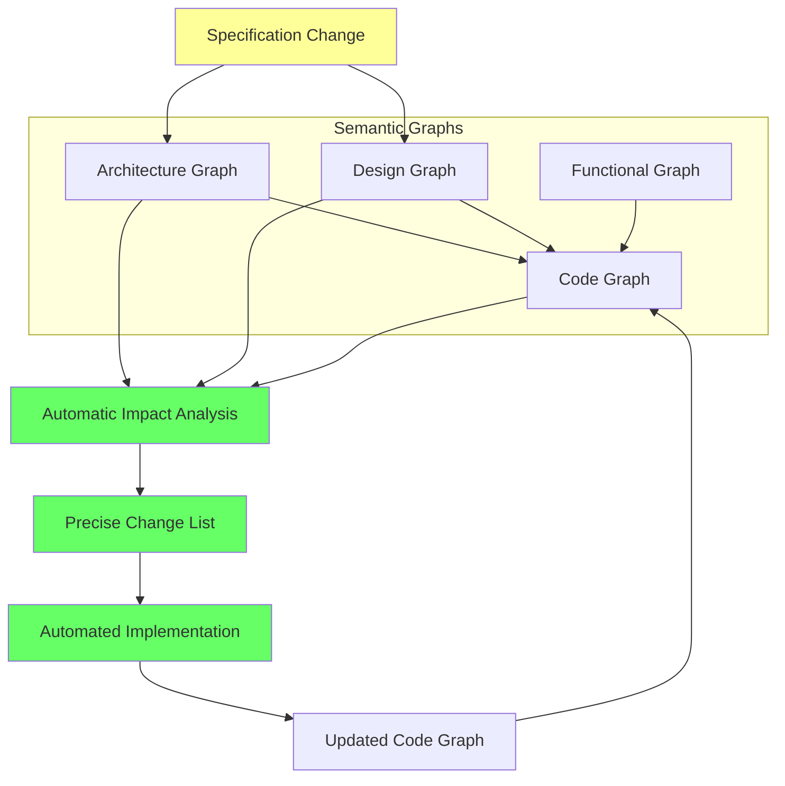
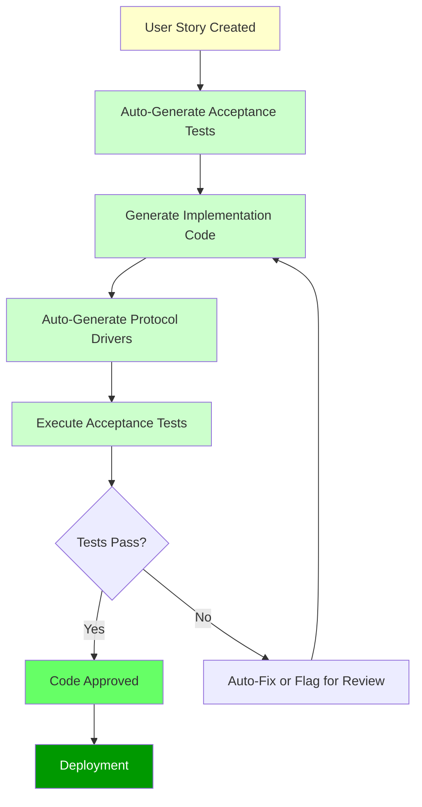

_System Architecture, Components, and Implementation Details_

## Breeze AI Framework Components

### System Architecture Overview

Breeze AI consists of multiple interconnected components that work together to transform traditional software development processes. The framework is built around four core ontology engines supported by specialized agents and interactive tools.

<svg viewBox="0 0 1200 800" xmlns="http://www.w3.org/2000/svg"> <!-- Background --> <rect width="1200" height="800" fill="#f8f9fa"/> <!-- Input Sources Layer --> <g> <rect x="50" y="50" width="250" height="120" rx="10" fill="#e3f2fd" stroke="#1976d2" stroke-width="2"/> <text x="175" y="75" text-anchor="middle" font-size="14" font-weight="bold" fill="#1976d2">Input Sources</text> <text x="70" y="95" font-size="11" fill="#333">• High-Level Requirements</text> <text x="70" y="110" font-size="11" fill="#333">• Legacy Documents</text> <text x="70" y="125" font-size="11" fill="#333">• Existing Code</text> <text x="70" y="140" font-size="11" fill="#333">• Design Artifacts</text> </g> <!-- Core Ontology Engines --> <g> <rect x="50" y="200" width="250" height="150" rx="10" fill="#e8f5e8" stroke="#388e3c" stroke-width="2"/> <text x="175" y="225" text-anchor="middle" font-size="14" font-weight="bold" fill="#388e3c">Core Ontology Engines</text> <rect x="70" y="240" width="90" height="30" rx="5" fill="#c8e6c9" stroke="#388e3c"/> <text x="115" y="258" text-anchor="middle" font-size="10" fill="#2e7d32">Functional</text> <rect x="170" y="240" width="90" height="30" rx="5" fill="#c8e6c9" stroke="#388e3c"/> <text x="215" y="258" text-anchor="middle" font-size="10" fill="#2e7d32">Architecture</text> <rect x="70" y="280" width="90" height="30" rx="5" fill="#c8e6c9" stroke="#388e3c"/> <text x="115" y="298" text-anchor="middle" font-size="10" fill="#2e7d32">Design</text> <rect x="170" y="280" width="90" height="30" rx="5" fill="#c8e6c9" stroke="#388e3c"/> <text x="215" y="298" text-anchor="middle" font-size="10" fill="#2e7d32">Code</text> </g> <!-- Knowledge Graphs --> <g> <rect x="350" y="200" width="200" height="150" rx="10" fill="#fff3e0" stroke="#f57c00" stroke-width="2"/> <text x="450" y="225" text-anchor="middle" font-size="14" font-weight="bold" fill="#f57c00">Knowledge Graphs</text> <circle cx="400" cy="260" r="25" fill="#ffcc02" stroke="#f57c00"/> <text x="400" y="265" text-anchor="middle" font-size="9" fill="#e65100">Functional</text> <circle cx="500" cy="260" r="25" fill="#ffcc02" stroke="#f57c00"/> <text x="500" y="265" text-anchor="middle" font-size="9" fill="#e65100">Architecture</text> <circle cx="400" cy="310" r="25" fill="#ffcc02" stroke="#f57c00"/> <text x="400" y="315" text-anchor="middle" font-size="9" fill="#e65100">Design</text> <circle cx="500" cy="310" r="25" fill="#ffcc02" stroke="#f57c00"/> <text x="500" y="315" text-anchor="middle" font-size="9" fill="#e65100">Code</text> <!-- Connections between graphs --> <line x1="425" y1="260" x2="475" y2="260" stroke="#f57c00" stroke-width="2"/> <line x1="400" y1="285" x2="400" y2="285" stroke="#f57c00" stroke-width="2"/> <line x1="425" y1="310" x2="475" y2="310" stroke="#f57c00" stroke-width="2"/> <line x1="425" y1="270" x2="475" y2="300" stroke="#f57c00" stroke-width="1"/> <line x1="475" y1="270" x2="425" y2="300" stroke="#f57c00" stroke-width="1"/> </g> <!-- AI Agent Layer --> <g> <rect x="600" y="50" width="200" height="200" rx="10" fill="#f3e5f5" stroke="#7b1fa2" stroke-width="2"/> <text x="700" y="75" text-anchor="middle" font-size="14" font-weight="bold" fill="#7b1fa2">AI Agent Layer</text> <rect x="620" y="90" width="80" height="25" rx="3" fill="#e1bee7" stroke="#7b1fa2"/> <text x="660" y="105" text-anchor="middle" font-size="9" fill="#4a148c">Extraction</text> <rect x="710" y="90" width="80" height="25" rx="3" fill="#e1bee7" stroke="#7b1fa2"/> <text x="750" y="105" text-anchor="middle" font-size="9" fill="#4a148c">Validation</text> <rect x="620" y="125" width="80" height="25" rx="3" fill="#e1bee7" stroke="#7b1fa2"/> <text x="660" y="140" text-anchor="middle" font-size="9" fill="#4a148c">Implementation</text> <rect x="710" y="125" width="80" height="25" rx="3" fill="#e1bee7" stroke="#7b1fa2"/> <text x="750" y="140" text-anchor="middle" font-size="9" fill="#4a148c">BDD Test</text> <rect x="665" y="160" width="80" height="25" rx="3" fill="#e1bee7" stroke="#7b1fa2"/> <text x="705" y="175" text-anchor="middle" font-size="9" fill="#4a148c">Evolution</text> </g> <!-- Interactive Tools --> <g> <rect x="600" y="280" width="200" height="150" rx="10" fill="#e0f2f1" stroke="#00695c" stroke-width="2"/> <text x="700" y="305" text-anchor="middle" font-size="14" font-weight="bold" fill="#00695c">Interactive Tools</text> <rect x="620" y="320" width="80" height="20" rx="3" fill="#b2dfdb" stroke="#00695c"/> <text x="660" y="332" text-anchor="middle" font-size="8" fill="#004d40">Graph Editor</text> <rect x="710" y="320" width="80" height="20" rx="3" fill="#b2dfdb" stroke="#00695c"/> <text x="750" y="332" text-anchor="middle" font-size="8" fill="#004d40">Documentation</text> <rect x="620" y="350" width="80" height="20" rx="3" fill="#b2dfdb" stroke="#00695c"/> <text x="660" y="362" text-anchor="middle" font-size="8" fill="#004d40">Visualization</text> <rect x="710" y="350" width="80" height="20" rx="3" fill="#b2dfdb" stroke="#00695c"/> <text x="750" y="362" text-anchor="middle" font-size="8" fill="#004d40">Validator</text> <rect x="665" y="380" width="80" height="20" rx="3" fill="#b2dfdb" stroke="#00695c"/> <text x="705" y="392" text-anchor="middle" font-size="8" fill="#004d40">Impact Analyzer</text> </g> <!-- Code Generation Pipeline --> <g> <rect x="850" y="50" width="200" height="200" rx="10" fill="#fce4ec" stroke="#c2185b" stroke-width="2"/> <text x="950" y="75" text-anchor="middle" font-size="14" font-weight="bold" fill="#c2185b">Code Generation</text> <rect x="870" y="90" width="80" height="25" rx="3" fill="#f8bbd9" stroke="#c2185b"/> <text x="910" y="105" text-anchor="middle" font-size="9" fill="#880e4f">Pattern Engine</text> <rect x="960" y="90" width="80" height="25" rx="3" fill="#f8bbd9" stroke="#c2185b"/> <text x="1000" y="105" text-anchor="middle" font-size="9" fill="#880e4f">Code Gen</text> <rect x="870" y="125" width="80" height="25" rx="3" fill="#f8bbd9" stroke="#c2185b"/> <text x="910" y="140" text-anchor="middle" font-size="9" fill="#880e4f">Test Gen</text> <rect x="960" y="125" width="80" height="25" rx="3" fill="#f8bbd9" stroke="#c2185b"/> <text x="1000" y="140" text-anchor="middle" font-size="9" fill="#880e4f">Protocol Gen</text> <rect x="915" y="160" width="80" height="25" rx="3" fill="#f8bbd9" stroke="#c2185b"/> <text x="955" y="175" text-anchor="middle" font-size="9" fill="#880e4f">Semantic Conv</text> </g> <!-- Integration Layer --> <g> <rect x="850" y="280" width="200" height="100" rx="10" fill="#fff8e1" stroke="#ffa000" stroke-width="2"/> <text x="950" y="305" text-anchor="middle" font-size="14" font-weight="bold" fill="#ffa000">Integration Layer</text> <rect x="870" y="320" width="80" height="20" rx="3" fill="#fff3c4" stroke="#ffa000"/> <text x="910" y="332" text-anchor="middle" font-size="8" fill="#e65100">Version Control</text> <rect x="960" y="320" width="80" height="20" rx="3" fill="#fff3c4" stroke="#ffa000"/> <text x="1000" y="332" text-anchor="middle" font-size="8" fill="#e65100">CI/CD</text> <rect x="915" y="350" width="80" height="20" rx="3" fill="#fff3c4" stroke="#ffa000"/> <text x="955" y="362" text-anchor="middle" font-size="8" fill="#e65100">Pull Requests</text> </g> <!-- Output Artifacts --> <g> <rect x="850" y="420" width="300" height="120" rx="10" fill="#e8eaf6" stroke="#3f51b5" stroke-width="2"/> <text x="1000" y="445" text-anchor="middle" font-size="14" font-weight="bold" fill="#3f51b5">Output Artifacts</text> <rect x="870" y="460" width="70" height="20" rx="3" fill="#c5cae9" stroke="#3f51b5"/> <text x="905" y="472" text-anchor="middle" font-size="8" fill="#1a237e">Code</text> <rect x="950" y="460" width="70" height="20" rx="3" fill="#c5cae9" stroke="#3f51b5"/> <text x="985" y="472" text-anchor="middle" font-size="8" fill="#1a237e">Tests</text> <rect x="1030" y="460" width="70" height="20" rx="3" fill="#c5cae9" stroke="#3f51b5"/> <text x="1065" y="472" text-anchor="middle" font-size="8" fill="#1a237e">Drivers</text> <rect x="870" y="490" width="70" height="20" rx="3" fill="#c5cae9" stroke="#3f51b5"/> <text x="905" y="502" text-anchor="middle" font-size="8" fill="#1a237e">Docs</text> <rect x="950" y="490" width="70" height="20" rx="3" fill="#c5cae9" stroke="#3f51b5"/> <text x="985" y="502" text-anchor="middle" font-size="8" fill="#1a237e">Diagrams</text> <rect x="1030" y="490" width="70" height="20" rx="3" fill="#c5cae9" stroke="#3f51b5"/> <text x="1065" y="502" text-anchor="middle" font-size="8" fill="#1a237e">Reports</text> </g> <!-- Main Flow Arrows --> <!-- Input to Ontology --> <path d="M 175 170 Q 175 190 175 200" stroke="#666" stroke-width="3" fill="none" marker-end="url(#arrowhead)"/> <!-- Ontology to Knowledge Graphs --> <path d="M 300 275 Q 325 275 350 275" stroke="#666" stroke-width="3" fill="none" marker-end="url(#arrowhead)"/> <!-- Knowledge Graphs to Agents --> <path d="M 550 250 Q 575 200 600 150" stroke="#666" stroke-width="3" fill="none" marker-end="url(#arrowhead)"/> <!-- Knowledge Graphs to Tools --> <path d="M 550 300 Q 575 325 600 350" stroke="#666" stroke-width="3" fill="none" marker-end="url(#arrowhead)"/> <!-- Agents to Code Generation --> <path d="M 800 150 Q 825 150 850 150" stroke="#666" stroke-width="3" fill="none" marker-end="url(#arrowhead)"/> <!-- Code Generation to Integration --> <path d="M 950 250 Q 950 265 950 280" stroke="#666" stroke-width="3" fill="none" marker-end="url(#arrowhead)"/> <!-- Integration to Output --> <path d="M 950 380 Q 950 400 950 420" stroke="#666" stroke-width="3" fill="none" marker-end="url(#arrowhead)"/> <!-- Feedback from Code Generation to Knowledge Graphs --> <path d="M 955 250 Q 700 550 500 350" stroke="#999" stroke-width="2" fill="none" stroke-dasharray="5,5" marker-end="url(#arrowhead)"/> <!-- Arrow marker definition --> <defs> <marker id="arrowhead" markerWidth="10" markerHeight="7" refX="9" refY="3.5" orient="auto"> <polygon points="0 0, 10 3.5, 0 7" fill="#666"/> </marker> </defs> <!-- Legend --> <g> <rect x="50" y="700" width="400" height="80" rx="5" fill="#ffffff" stroke="#ccc" stroke-width="1"/> <text x="60" y="720" font-size="12" font-weight="bold" fill="#333">Data Flow Legend</text> <line x1="60" y1="735" x2="90" y2="735" stroke="#666" stroke-width="3" marker-end="url(#arrowhead)"/> <text x="100" y="740" font-size="10" fill="#333">Primary Flow</text> <line x1="60" y1="750" x2="90" y2="750" stroke="#999" stroke-width="2" stroke-dasharray="5,5" marker-end="url(#arrowhead)"/> <text x="100" y="755" font-size="10" fill="#333">Feedback Loop</text> <text x="250" y="740" font-size="10" fill="#333">Connected components enable</text> <text x="250" y="755" font-size="10" fill="#333">bidirectional semantic alignment</text> </g> </svg>

### Core Components Detailed

#### 1. Ontology Engines

**Functional Ontology Engine**

- Processes business requirements and user stories
- Extracts semantic meaning and relationships between functional elements
- Maintains traceability from high-level goals to detailed specifications
- Integrates with product management tools and backlog systems

**Architecture Ontology Engine**

- Leverages Accion's proven architectural blueprints
- Encodes structural patterns, component relationships, and system boundaries
- Maintains consistency with established architectural principles
- Supports multiple architectural styles (microservices, layered, event-driven, etc.)
- **Evolution Capability**: Enables systematic updates to architectural patterns with automatic impact analysis

**Design Ontology Engine**

- Captures UI/UX patterns and design system specifications
- Maintains consistency across user interface components
- Integrates with design tools and style guides
- Ensures accessibility and usability standards compliance
- **Evolution Capability**: Supports design system modernization with traceable change propagation

**Code Ontology Engine**

- Converts generated code into machine-readable code semantic graphs
- Maintains bidirectional mapping between implementation and specifications
- Enables precise change impact analysis and evolution tracking
- Supports multiple programming languages and frameworks through unified semantic representation

#### 2. AI Agent Layer

**Extraction Agents**

- **Document Parser Agents**: Convert traditional requirement documents into structured knowledge graphs
- **Code Analysis Agents**: Reverse-engineer specifications from existing codebases
- **Diagram Interpretation Agents**: Extract architectural and design information from visual artifacts
- **Legacy System Analyzers**: Identify patterns and structures in brownfield applications

**Validation Agents**

- **Consistency Checkers**: Ensure alignment between functional, architectural, and design specifications
- **Completeness Validators**: Identify gaps or missing elements in ontology graphs
- **Conflict Resolvers**: Detect and flag contradictions between different specification layers
- **Quality Assessors**: Evaluate specification quality against best practices

**Custom Implementation Agents**

- **Pattern-Specific Generators**: Handle frequently occurring requirement patterns
- **Domain-Specific Agents**: Specialized for particular business domains or technical stacks
- **Framework Integrators**: Generate code aligned with specific development frameworks
- **Security Compliance Agents**: Ensure generated code meets security requirements

**BDD Test Agents**

- **Acceptance Test Generators**: Create domain-specific language tests from functional specifications
- **Protocol Driver Creators**: Build translation layers between domain terms and implementation
- **Test Execution Orchestrators**: Manage automated test execution and reporting
- **Coverage Analyzers**: Ensure comprehensive test coverage across all specification layers

**Evolution Agents**

- **Architectural Evolution Specialists**: Analyze impact of architectural pattern updates across entire codebases
- **Design System Modernizers**: Manage systematic updates to design patterns and user experience standards
- **Security Pattern Updaters**: Implement security best practice evolution across application components
- **Performance Optimization Agents**: Apply emerging performance patterns systematically throughout applications

#### 3. Interactive Validation Tools

**Visual Graph Editor**

- Provides intuitive interfaces for reviewing and modifying knowledge graphs
- Supports drag-and-drop editing of ontology relationships
- Offers multiple visualization modes (hierarchical, network, timeline)
- Enables collaborative editing with role-based access controls

**Interactive Documentation Generator**

- Creates human-readable documentation from knowledge graphs
- Supports multiple output formats (HTML, PDF, Confluence, etc.)
- Maintains real-time synchronization with underlying specifications
- Provides customizable templates for different stakeholder needs

**Diagram Visualization Tool**

- Generates architectural diagrams from structural ontologies
- Creates UI mockups and wireframes from design specifications
- Supports standard notation formats (UML, C4, ArchiMate)
- Enables export to popular diagramming tools

**Specification Validator**

- Provides real-time feedback on specification quality and completeness
- Offers guided workflows for specification creation and refinement
- Integrates with existing requirement management tools
- Supports custom validation rules and organizational standards

**Evolution Impact Analyzer**

- **Change Impact Visualization**: Shows exactly which code components will be affected by architectural or design changes
- **Effort Estimation**: Provides quantified estimates for evolution initiatives
- **Risk Assessment**: Identifies potential complications or dependencies in proposed changes
- **Rollback Planning**: Enables systematic rollback strategies for evolution implementations

#### 4. Code Generation Pipeline

**Pattern Recognition Engine**

- Identifies recurring patterns in requirement specifications
- Learns from previous implementations to improve pattern matching
- Maintains a library of organizational-specific patterns
- Enables continuous improvement of automation coverage

**Code Generator**

- Produces implementation code aligned with all ontology layers
- Supports multiple programming languages and frameworks
- Maintains code quality standards and organizational conventions
- Integrates with existing development toolchains

**Test Generator**

- Creates comprehensive test suites including unit, integration, and acceptance tests
- Generates test data and mock configurations
- Ensures test coverage across all specification requirements
- Maintains test maintainability and readability standards

**Protocol Driver Generator**

- Creates translation layers for behavior-driven testing
- Generates step definitions for acceptance test execution
- Maintains semantic consistency between domain language and implementation
- Supports multiple BDD frameworks (Cucumber, SpecFlow, Behave, etc.)

**Code Semantic Converter**

- **Bidirectional Processing**: Converts generated code into semantic graph representation and maintains synchronization
- **Specification Linkage**: Maintains direct connections between code components and their originating specifications
- **Change Tracking**: Enables precise identification of code requiring modification when specifications evolve
- **Quality Validation**: Ensures generated code maintains semantic consistency with specifications

#### 5. Integration Layer

**Version Control Integration**

- Automated branch creation and management for generated code
- Maintains traceability between specifications and implementation
- Supports multiple version control systems (Git, SVN, Perforce)
- Enables specification versioning and change tracking

**CI/CD Pipeline Connector**

- Integrates generated code and tests into existing build processes
- Triggers automated quality gates and validation checks
- Supports popular CI/CD platforms (Jenkins, Azure DevOps, GitHub Actions)
- Enables continuous deployment of agent-generated components

**Pull Request Automation**

- Creates structured pull requests with comprehensive documentation
- Includes impact analysis and change summaries
- Facilitates code review processes with specification context
- Maintains audit trails for compliance and governance

**Quality Gates**

- Enforces quality standards before code integration
- Validates specification alignment throughout the development process
- Provides metrics and reporting on automation effectiveness
- Enables continuous improvement of agent performance

### Component Interaction Patterns

The Breeze AI components operate through well-defined interaction patterns that ensure seamless workflow integration:

**Specification-Driven Development Flow**

1. Requirements enter through ontology engines
2. Knowledge graphs are validated using interactive tools
3. Custom agents generate implementation artifacts
4. Integration layer manages deployment and quality assurance

**Legacy Modernization Flow**

1. Extraction agents analyze existing artifacts
2. Knowledge graphs are constructed and validated
3. Gap analysis identifies modernization opportunities
4. Implementation agents generate updated code aligned with modern specifications

**Continuous Improvement Flow**

1. Pattern recognition engine identifies new automation opportunities
2. Semantic engineers create specialized agents
3. Agent performance is monitored and optimized
4. Organizational pattern library is continuously expanded

## Implementation Workflows

### Greenfield Development Process Continuation

**Continuous Improvement**: Over time, the coverage of specifications by agents continues to increase through ongoing collaboration between agent developers, semantic engineers, and software engineers. As new patterns are identified and agents are developed, the proportion of automated implementation grows while maintaining quality standards.



### Brownfield Development: Modernizing Legacy Systems

Brownfield software projects—where applications require enhancement, reengineering, or modernization—follow a similar process but with crucial initial steps to handle legacy system analysis.

#### The Legacy Challenge

In brownfield projects, detailed documentation of functional, architectural, and design specifications is often absent or inadequate. Applications may have evolved over years through bug fixes, feature additions, and partial refactoring without maintaining comprehensive specifications. Original architects and designers may no longer be available, and institutional knowledge may exist only in the form of code that implements solutions but doesn't explain the reasoning behind design decisions.

#### Automated Legacy Analysis

**Artifact Extraction**: Core Breeze AI ontology agents analyze and convert existing artifacts—documents, diagrams, or entire code repositories—into machine-readable functional, architectural, and design semantic graphs. This process goes beyond simple documentation extraction; it performs semantic analysis to understand the implicit patterns and relationships that exist in the legacy system.

**Knowledge Reconstruction**: The agents identify architectural patterns, design conventions, and functional behaviors that may not be explicitly documented anywhere. This creates a comprehensive semantic model of the existing system that serves as the foundation for modernization efforts.

**Gap Identification**: Once legacy systems are represented as knowledge graphs, the interactive visualization tools help identify missing specifications, inconsistent implementations, and areas where the existing system deviates from modern best practices.

#### Modernization Process

After legacy system analysis, the process follows the same pattern as greenfield development, but with the advantage of having a complete semantic understanding of the existing system. This enables:

- **Gradual Modernization**: Legacy components can be modernized incrementally while maintaining system integrity
- **Pattern Migration**: Existing patterns can be analyzed and improved while preserving business logic
- **Quality Improvement**: Modern implementation can maintain functional behavior while improving architectural and design adherence

### Specification Evolution Management

**Dynamic Semantic Graph Updates**: With Breeze AI, architectural and design evolution eliminates the Manual Translation Tax entirely. Changes can be made to architecture and design semantic graphs through the ontology agents, immediately creating a clear, measurable understanding of exactly what changes are required across the application—with zero ambiguity or interpretation required.

**The Fourth Ontology: Code Semantic Graphs**: A critical component of this evolution capability is that code generated by agents is automatically converted into code semantic graphs using the code ontology. This creates a complete bidirectional mapping between specifications and implementation that eliminates the Manual Translation Tax for change management.

**Connected Knowledge Architecture**: The architecture and design semantic graphs maintain direct connections to the code semantic graph, providing accurate and traceable change requirements when architectural or design modernization is needed. This connectivity ensures that the Manual Translation Tax is eliminated through:



- **Automatic Impact Analysis**: When architectural patterns are updated, the system immediately identifies every code component that needs modification—no manual analysis required
- **Measurable Change Scope**: The exact effort required for architectural evolution can be quantified automatically before implementation begins
- **Guaranteed Consistency**: All related code changes follow the same updated patterns automatically—no coordination overhead between teams
- **Perfect Traceability**: Every change can be traced back to the specific architectural or design evolution that required it—eliminating guesswork and interpretation

### Practical Evolution Scenarios

**Security Pattern Modernization**: When new security best practices emerge, they can be incorporated into the architecture semantic graph. The connected code semantic graph immediately identifies every authentication, authorization, and data handling component that needs updating to align with the new security patterns.

**Performance Optimization Evolution**: As new performance patterns are proven effective, they can be integrated into the architectural ontology. The system automatically identifies database access patterns, caching strategies, and API designs that should be updated to leverage the improved approaches.

**Design System Evolution**: When user experience standards advance or accessibility requirements change, updates to the design semantic graph automatically identify every user interface component that needs modification to align with the evolved design standards.

## Behavior-Driven Development Integration

### Traditional BDD Implementation Challenge

Behavior-driven testing has proven to improve functional requirement adherence significantly, yet many teams struggle with implementation due to the manual overhead involved.

**The Traditional BDD Process Requires**:

1. **Manual Test Writing**: Development teams must write acceptance tests for each user story using domain-specific languages like Gherkin
2. **Protocol Driver Creation**: Teams must create and maintain translation layers between domain-specific terms used in acceptance tests and the actual implementation code
3. **Ongoing Maintenance**: As requirements evolve, both acceptance tests and protocol drivers must be manually updated to maintain synchronization

**Example Traditional BDD Workflow**:

```gherkin
Feature: User Authentication
  Scenario: Successful login
    Given a user exists with username "john@example.com"
    When the user enters valid credentials
    Then the user should be redirected to the dashboard
```

**The Reality Gap**: While teams acknowledge that BDD increases efficiency and productivity, the additional workload often proves unsustainable under deadline pressure. This creates a frustrating situation where teams know a practice improves quality but can't consistently implement it due to resource constraints.

### Breeze AI's BDD Revolution: Making Quality Automatic

**Default BDD Integration**: In Breeze AI, agents created for specific use cases automatically follow behavior-driven testing principles. This isn't an optional feature that teams can skip under pressure—it's built into the fundamental agent behavior.

**Automatic Acceptance Test Generation**: When user stories are created in the backlog, acceptance tests are automatically generated in domain-specific language. The semantic understanding capabilities of Breeze AI agents ensure these tests accurately capture the business intent behind the requirements.

**Automatic Protocol Driver Creation**: When code is generated to implement user stories, the protocol drivers that translate between domain-specific terms and implementation are automatically created and maintained. This eliminates one of the most tedious aspects of BDD implementation.

**Continuous Validation**: Acceptance tests are automatically executed to ensure that generated code accurately achieves functional requirements. This validation happens continuously throughout the development process, catching any deviations immediately.

**The Transformation Effect**: With Breeze AI agents, behavior-driven testing becomes the norm rather than an aspirational practice. Quality validation occurs automatically without requiring additional effort from development teams, making it sustainable even under aggressive deadlines.



### The Economic Impact: Quality Without Compromise

**Traditional Trade-off**: Teams often face a choice between development speed and quality practices like BDD. Under deadline pressure, quality practices are frequently sacrificed.

**Breeze AI Elimination of Trade-offs**: Since BDD implementation is automatic, teams no longer face this compromise. They get the quality benefits of behavior-driven development without any additional overhead, making high-quality implementation the path of least resistance rather than the path of most effort.

## Business Impact and Benefits

### Quantifiable Improvements

|Traditional Approach|Breeze AI Approach|
|---|---|
|Manual specification alignment|Automated ontology validation|
|Reactive technical debt management|Proactive alignment enforcement|
|Optional BDD implementation|Default BDD integration|
|Document-based requirements|Machine-readable knowledge graphs|
|Periodic architecture reviews|Continuous architectural compliance|
|Manual evolution analysis|Automatic impact assessment|
|Specification drift over time|Perfect specification-implementation synchronization|

### Coverage and Scalability

- **Pattern-Based Automation**: Frequently occurring requirements are handled entirely by custom agents
- **Novel Requirement Support**: Complex or unique requirements continue to leverage human developers supported by standard AI tools
- **Expanding Coverage**: Agent coverage increases over time through collaboration between semantic engineers and development teams
- **Evolution Management**: Architectural and design modernization becomes systematic and risk-managed

### Risk Mitigation

- **Specification Drift Prevention**: Machine-readable requirements prevent gradual deviation from original specifications
- **Legacy System Documentation**: Automatic extraction of specifications from existing codebases eliminates documentation gaps
- **Quality Assurance**: Built-in BDD ensures functional requirements are met while architectural compliance is maintained
- **Change Impact Visibility**: Complete understanding of modification requirements before implementation begins

### The Competitive Advantage of Eliminating Translation Tax

**Traditional Approach**: Architectural modernization projects are high-risk, high-effort undertakings that often fail due to the overwhelming Manual Translation Tax—incomplete impact analysis, inconsistent implementation, and coordination failures across teams.

**Breeze AI Approach**: Architectural and design evolution becomes an ongoing, manageable process rather than a disruptive project. Organizations can continuously modernize their applications to leverage emerging best practices without paying the traditional Manual Translation Tax associated with large-scale refactoring.

**Measurable ROI**: Because change impact is precisely quantifiable and the Manual Translation Tax is eliminated, organizations can make informed decisions about which architectural improvements provide the best return on investment and implement them systematically over time without the traditional overhead costs.

### The Complete Lifecycle Management

The combination of initial semantic graph creation, ongoing implementation through custom agents, and systematic evolution capabilities means that Breeze AI provides complete lifecycle management for software applications:

1. **Creation**: Applications begin with current best practices encoded in semantic graphs
2. **Implementation**: Code is generated that strictly adheres to these best practices
3. **Evolution**: As best practices advance, applications can be systematically updated to leverage improvements
4. **Maintenance**: The connection between specifications and implementation ensures that quality is maintained throughout the application's lifetime

This comprehensive approach transforms software development from a process that inevitably accumulates technical debt and imposes ever-increasing Manual Translation Tax into one that can continuously improve and modernize while maintaining perfect specification alignment and zero translation overhead.

## Implementation Strategy

### Gradual Adoption Model

Organizations can adopt Breeze AI incrementally:

1. **Pilot Projects**: Start with well-defined, pattern-rich components
2. **Pattern Library Development**: Build custom agent coverage for organizational patterns
3. **Legacy System Integration**: Gradually extract and modernize existing applications
4. **Full Workflow Integration**: Scale to comprehensive development process automation

### Team Collaboration Framework

- **Semantic Engineers**: Develop and maintain ontology structures and custom agents
- **Product Owners**: Define and validate functional requirements through interactive tools
- **Architects/Designers**: Refine and approve architectural and design ontologies
- **Software Engineers**: Review generated code, handle novel requirements, and collaborate on pattern identification

### Integration Points

- **Version Control**: Automatic branch creation and pull request management
- **CI/CD Pipeline**: Seamless integration with existing development workflows
- **Documentation Systems**: Automatic generation of human-readable specifications
- **Testing Frameworks**: Native BDD test execution and validation
- **Project Management Tools**: Integration with backlog and requirement management systems
- **Design Tools**: Synchronization with design systems and prototyping platforms

## Technical Requirements and Considerations

### Infrastructure Requirements

**Computational Resources**: Breeze AI requires significant computational resources for:

- Knowledge graph processing and analysis
- AI agent training and execution
- Real-time semantic analysis
- Large-scale code generation

**Storage Requirements**:

- Semantic graph storage with high-performance querying capabilities
- Version control for both specifications and generated artifacts
- Audit trail maintenance for compliance and governance

**Network Requirements**:

- Integration with existing development tools and platforms
- Real-time collaboration capabilities for distributed teams
- Secure communication for sensitive specification data

### Security and Compliance

**Data Protection**: All semantic graphs and generated code are protected through:

- Encryption at rest and in transit
- Role-based access controls
- Audit logging of all specification changes
- Compliance with industry standards (SOC 2, GDPR, etc.)

**Intellectual Property Protection**:

- Generated code ownership and licensing clarity
- Protection of organizational patterns and best practices
- Secure handling of proprietary architectural knowledge

### Scalability Considerations

**Horizontal Scaling**: Breeze AI architecture supports:

- Distributed agent execution across multiple compute nodes
- Parallel processing of large codebases
- Load balancing for high-availability deployments

**Performance Optimization**:

- Caching of frequently accessed semantic patterns
- Incremental processing for large-scale changes
- Optimized query engines for knowledge graph operations

## Future Roadmap and Evolution

### Planned Enhancements

**Advanced AI Capabilities**:

- Enhanced natural language processing for requirement extraction
- Improved pattern recognition through machine learning
- Predictive analytics for technical debt prevention

**Extended Platform Support**:

- Additional programming language and framework support
- Integration with emerging development platforms
- Support for cloud-native and serverless architectures

**Enhanced Collaboration Features**:

- Real-time collaborative editing of semantic graphs
- Advanced visualization and simulation capabilities
- Integrated communication and decision-making tools

### Research and Development Focus Areas

**Semantic Model Evolution**:

- Automatic ontology refinement based on usage patterns
- Cross-organizational knowledge sharing capabilities
- Industry-specific semantic model development

**Quality Assurance Innovation**:

- Advanced testing strategy generation
- Performance optimization recommendations
- Security vulnerability detection and remediation

**Developer Experience Enhancement**:

- Improved IDE integration and developer tooling
- Enhanced debugging and troubleshooting capabilities
- Streamlined onboarding and training processes

## Conclusion

Breeze AI represents a fundamental transformation in software engineering methodology. By eliminating the Manual Translation Tax through machine-readable knowledge graphs and intelligent automation, organizations can achieve unprecedented levels of specification alignment, quality assurance, and development efficiency.

The framework's comprehensive approach—from initial requirements capture through ongoing evolution management—provides a sustainable path forward for organizations seeking to modernize their software development practices while managing technical debt and maintaining high-quality standards.

As the software industry continues to evolve, Breeze AI positions organizations to adapt systematically to new best practices, technologies, and requirements without the traditional risks and costs associated with large-scale architectural changes. The result is a development process that continuously improves rather than gradually degrades, setting a new standard for enterprise software engineering.

---

_This technical guide provides comprehensive details on Breeze AI's architecture and implementation. 