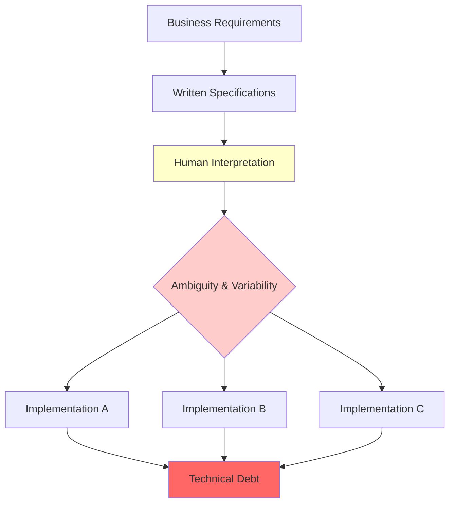
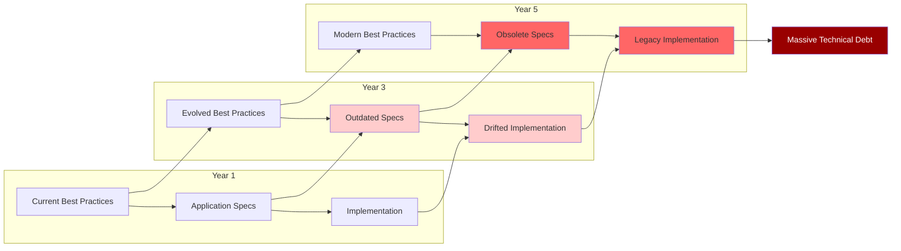
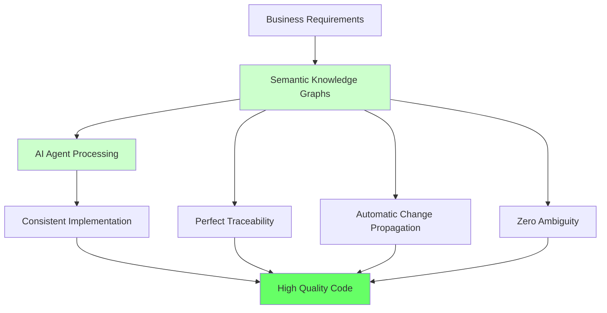
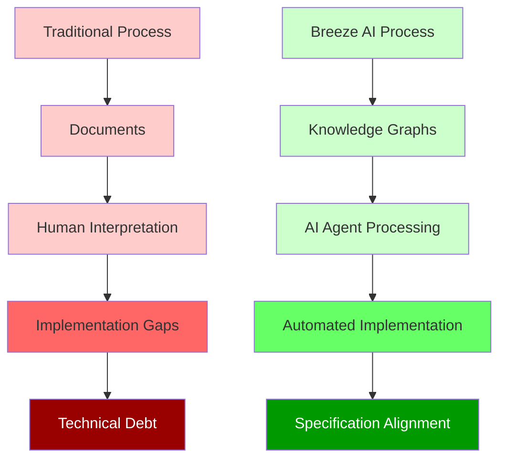
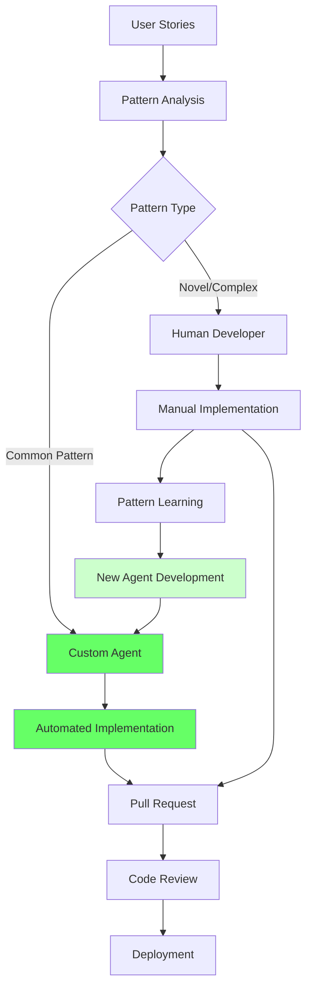
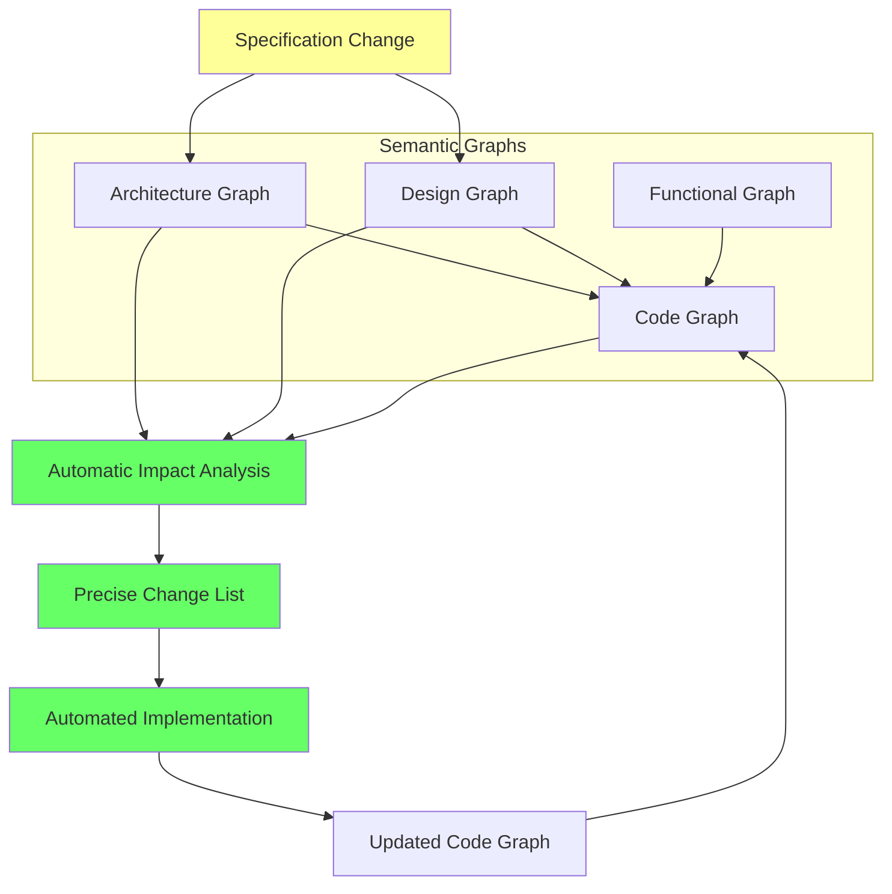
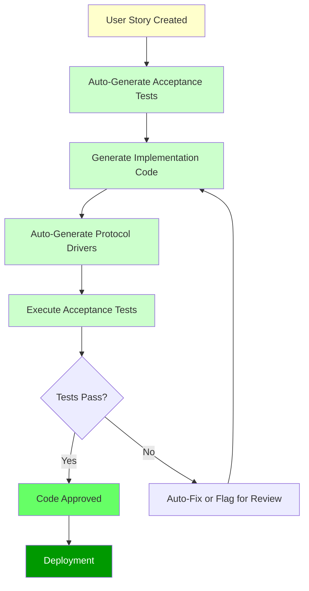

# Breeze AI: Semantic Engineering Framework

_Accion's Revolutionary Approach to Software Development_

## Executive Summary

Breeze AI represents a paradigm shift in software engineering, addressing one of the industry's most persistent challenges: maintaining alignment between functional requirements, architectural guidelines, and design specifications throughout the development lifecycle. By leveraging machine-readable knowledge graphs and AI-powered agents, Breeze AI automates significant portions of software implementation while ensuring strict adherence to all three critical aspects of software requirements.

**Key Value Propositions:**

- Eliminates technical debt caused by misalignment between implementation and architectural/design specifications
- Automates behavior-driven testing as a standard practice
- Reduces manual development workload while improving code quality
- Provides comprehensive documentation extraction and maintenance for legacy systems

## The Challenge: Why Traditional Software Engineering Creates Persistent Problems

### The Fundamental Flaw: The Manual Translation Tax

In conventional software engineering processes, the three critical aspects of requirements—functional, architectural, and design—are created as documents that impose what we call the "Manual Translation Tax." This tax represents the impedance mismatch in the manual development process caused by ambiguity in specifications, resulting in lack of traceability of adherence to specifications and inability to track changes in specifications.



**The Translation Tax Components**:

- **Interpretation Overhead**: Every developer must manually interpret written specifications, introducing variability and potential misunderstanding
- **Ambiguity Resolution**: Unclear specifications require time-consuming clarification cycles between developers, architects, and product owners
- **Traceability Loss**: No systematic way to verify that implementation actually follows the specified requirements
- **Change Propagation Failure**: When specifications evolve, there's no automatic mechanism to identify what implementation changes are required

This Manual Translation Tax creates an insurmountable gap between specification and implementation that no amount of process improvement can fully bridge, because the fundamental issue is the lack of machine-processable semantic meaning in traditional documentation.

### The Waterfall Reality: When Detailed Specifications Become Impossible

In traditional waterfall development methodology, functional requirements created by product owners and business owners are expected to flow through a structured process:

1. **High-Level Requirements**: Product owners define functional needs
2. **Architectural Guidelines**: Architects create backend architecture specifications
3. **Design Systems**: Designers establish frontend design guidelines
4. **Detailed Specifications**: High-level requirements are broken down into implementable details
5. **Code Implementation**: Developers write code expected to automatically adhere to all guidelines

**The Critical Breakdown Point**: The effort required to create truly detailed specifications that maintain alignment with architectural and design guidelines is often impossible in real-world scenarios, particularly when:

- Requirements are overly complex with intricate interdependencies
- Applications have been in operation and evolution for extended periods
- Business needs change faster than documentation can be maintained

**The Inevitable Result**: Specifications become inadequate, leaving significant scope for misalignment between what is implemented and what was originally required. This creates a dangerous assumption gap—teams assume that following incomplete detailed specifications will automatically ensure adherence to high-level functional, architectural, and design requirements.

### The Agile Paradox: Architecture Lost in Sprints

Agile methodologies attempt to solve waterfall's rigidity but create their own alignment challenges while completely failing to address specification evolution:

**The Agile Promise**: Detailed functional requirements are captured in backlogs as user stories, providing flexibility and responsiveness to change.

**The Architectural Reality**:

- Architecture and design decisions are typically made at the beginning of implementation and then treated as static
- Architects and designers rarely participate actively in ongoing agile sprints, leaving no mechanism for specification evolution
- Software engineers responsible for implementation are expected to manually study and adhere to architectural and design guidelines that may be years old
- When designers do participate, they create wireframes and prototypes expected to align with design guidelines, but these guidelines themselves may be outdated relative to current best practices

**The Specification Stagnation Problem**: Agile processes excel at evolving functional requirements through iterative feedback, but provide no equivalent mechanism for evolving architectural and design specifications. This creates a fundamental asymmetry where business requirements stay current while technical specifications become increasingly obsolete.

**The Hidden Complexity of Architectural Evolution**: While the reverse Conway's law recommends that software architecture should mimic team structure, this oversimplifies both the challenge of initial architecture and the challenge of architectural evolution. Architectural guidelines encompass technical patterns, scalability considerations, security requirements, integration standards, and countless other factors that not only cannot be represented by team structures alone, but also evolve independently of organizational changes.

### The Devastating Impact: Where Technical Debt Really Comes From

**Functional Alignment Success**: Misalignment between implementation and functional requirements is relatively rare because the testing process naturally catches and corrects such gaps. When a feature doesn't work as expected, it's immediately obvious and gets fixed.

**Architectural and Design Alignment Failure**: Misalignment between implementation and architectural or design requirements occurs frequently and often goes undetected because:

- These misalignments don't typically cause immediate functional failures
- Manual verification of architectural compliance is time-consuming and often skipped under deadline pressure
- Design consistency issues may be noticed but are often deprioritized as "polish" items
- The cumulative effect only becomes apparent over time as technical debt

**The Hidden Evolution Challenge**: Beyond implementation misalignment lies an even more insidious problem—architectural and design specifications themselves become outdated over time. While these specifications don't change as frequently as functional requirements, they do evolve as:

- **Security Standards Advance**: New threat vectors emerge requiring updated security patterns and practices
- **Performance Optimization Techniques Improve**: Better algorithms, caching strategies, and architectural patterns are developed
- **User Experience Expectations Shift**: Design standards evolve to meet changing user needs and accessibility requirements
- **Technology Platforms Mature**: New capabilities in frameworks, databases, and infrastructure create opportunities for better architectural approaches
- **Scalability Requirements Change**: As applications grow, architectural patterns that worked at smaller scales become inadequate

**The Double Compounding Effect**: Applications suffer from both implementation drift (code deviating from current specifications) AND specification obsolescence (specifications becoming outdated relative to current best practices). Each misaligned implementation decision creates technical debt, while each unchanged specification that should be updated creates additional technical debt. This creates a compound effect where applications become increasingly difficult to maintain, enhance, or scale.



**The Impossible Economics**: In traditional development approaches, keeping specifications current with evolving best practices is often economically unfeasible because:

- **Analysis Paralysis**: Understanding the impact of updating architectural or design specifications requires extensive manual analysis
- **Implementation Uncertainty**: Teams can't predict the full scope of changes required, making it difficult to justify the investment
- **Risk Aversion**: The uncertainty about specification evolution impact makes teams reluctant to undertake modernization efforts
- **Resource Competition**: Specification evolution competes with feature development for limited resources, and feature development usually wins

### The Behavior-Driven Development Dilemma

Behavior-driven testing represents a proven methodology that dramatically improves functional requirement adherence, yet it faces adoption challenges that reveal deeper systemic issues:

**The BDD Process**:

1. Define acceptance tests for each user story using domain-specific language (like Gherkin)
2. Implement code to fulfill the user story requirements
3. Create protocol drivers that translate between domain-specific terms and actual code
4. Execute acceptance tests to validate functional requirement achievement

**The BDD Reality**: While BDD almost certainly increases efficiency and productivity, it creates additional workload that many software teams struggle to maintain consistently. The overhead of writing domain-specific tests and maintaining protocol drivers often leads to incomplete adoption or eventual abandonment.

**The Manual Translation Tax in Practice**: Teams acknowledge that BDD improves quality but can't sustain the manual effort required to implement it properly. This highlights a fundamental issue—when quality-improving practices require paying the Manual Translation Tax through significant manual overhead, they become casualties of deadline pressure and resource constraints.

### The Legacy Documentation Crisis

For software applications that have been in operation for several years, both the documentation problem and the specification evolution problem become even more acute:

**Missing Documentation**: Detailed functional, architectural, and design specifications often don't exist or are severely outdated relative to current implementation.

**Knowledge Erosion**: Original architects and designers may have left the organization, taking contextual knowledge about both current specifications and the reasoning behind design decisions.

**Evolution Without Documentation**: Applications continue to evolve through bug fixes and enhancements, but these changes rarely update comprehensive specifications. Meanwhile, the specifications that do exist become increasingly obsolete relative to current best practices.

**The Specification Time Warp**: Many legacy applications are operating with architectural and design specifications that reflect best practices from years or even decades ago. Security patterns may predate current threat models, performance optimization may not leverage modern infrastructure capabilities, and user experience patterns may not meet current accessibility or usability standards.

**Reverse Engineering Impossibility**: Attempting to reconstruct not only current design intent from existing code, but also to modernize that intent to current best practices, is time-consuming, error-prone, and often incomplete. Teams must simultaneously figure out what the application currently does AND what it should be doing according to modern standards.

**The Vicious Modernization Cycle**: Applications that most need modernization (legacy systems with outdated specifications) are also the ones with the least reliable foundation for that modernization. This creates a vicious cycle where the applications that would benefit most from specification evolution are also the ones where such evolution is most risky and difficult to implement.

## The Breeze AI Solution: Eliminating the Manual Translation Tax

### The Revolutionary Foundation: Machine-Readable Knowledge Graphs

Breeze AI addresses the Manual Translation Tax by representing functional, architectural, and design requirements as machine-readable knowledge graphs built on well-defined and proven ontologies. This isn't simply a documentation improvement—it's a complete elimination of the translation impedance mismatch that has historically plagued software development.



**Eliminating Translation Tax Components**:

- **Zero Interpretation Variability**: Machine-readable semantics eliminate human interpretation inconsistencies
- **Unambiguous Specifications**: Formal ontologies remove ambiguity through precise semantic definitions
- **Perfect Traceability**: Direct connections between specifications and implementation enable automatic adherence verification
- **Automatic Change Propagation**: Specification changes automatically identify required implementation modifications

**The Critical Difference**: Unlike traditional documents that impose the Manual Translation Tax through required human interpretation, knowledge graphs can be systematically understood, validated, and processed by AI agents. This eliminates the translation layer that has historically been the source of most implementation misalignments and project inefficiencies.

### Solving the Legacy Documentation Problem

One of Breeze AI's most immediately valuable capabilities addresses the crisis facing long-standing applications:

**Automatic Knowledge Extraction**: Breeze AI agents can convert existing artifacts—documents, diagrams, or even code repositories—into structured knowledge graphs using predefined and proven ontologies. This capability alone addresses a major challenge that has plagued software applications written years ago that often lack detailed documentation.

**Validation and Accuracy**: Human product owners, architects, and designers can validate if extracted information is accurate and complete. To facilitate this validation process, agents represent knowledge graphs through interactive visualizations, documents, and diagrams that make review and correction straightforward.

**The Tip of the Iceberg Principle**: While creating structured documentation from existing artifacts or code provides immediate value, this capability represents just the beginning of what becomes possible once these knowledge graphs exist.

### The Game-Changing Implementation: Custom Agents with Semantic Understanding

Once knowledge graphs are established, Breeze AI enables the creation of custom agents that understand the functional, architectural, and design semantic models represented in these graphs. These agents can automatically create code that not only achieves functional requirements but strictly adheres to architectural and design guidelines.

**The Competitive Advantage Over Standard Tools**: While out-of-the-box agent tools like Cursor or Copilot can perform relatively complex code generation, they fundamentally lack the ability to create or use detailed, contextual semantic models by themselves. They operate without understanding the specific architectural patterns, design systems, or business domain models that are critical for enterprise-quality software development.

**Beyond Simple Code Generation**: In addition to structured semantic models, enterprise software development requires custom agent workflows that represent typical use cases occurring in long-standing applications. These patterns often repeat across different parts of an application but cannot be captured as strict business rules—they require contextual understanding that only custom agents with semantic model awareness can provide.

### Automatic Behavior-Driven Development: Making Quality the Default

Traditional BDD implementation requires manual effort that many teams can't sustain. Breeze AI transforms this equation entirely:

**Default BDD Implementation**: Agents created for specific use cases automatically follow behavior-driven testing principles. This isn't an optional add-on—it's built into the core agent behavior.

**Automatic Acceptance Test Creation**: Once a user story is created in the backlog, acceptance tests are automatically generated in domain-specific language, eliminating the manual effort that typically prevents BDD adoption.

**Automatic Protocol Driver Generation**: When code is generated to implement user stories, the protocol drivers that translate between domain-specific terms and implementation code are automatically created, removing another manual overhead barrier.

**Continuous Validation**: Acceptance tests are automatically evaluated to ensure that generated code accurately achieves functional requirements, making quality validation a seamless, zero-overhead process.

**The Transformation**: With Breeze AI agents, behavior-driven testing becomes the norm rather than an aspirational practice that teams struggle to maintain under deadline pressure.

### The Compound Quality Effect

The combination of semantic model understanding and automatic BDD implementation creates a compound effect:

- **Speed**: Common requirement patterns are implemented dramatically faster through automated agent workflows
- **Quality**: Implementation is almost guaranteed to strictly adhere to functional, architectural, and design specifications
- **Consistency**: Every implementation follows the same high standards without manual verification overhead
- **Sustainability**: Quality practices are maintained automatically regardless of deadline pressure or resource constraints

### Addressing the Impossible Effort Problem

Breeze AI fundamentally changes the economics of detailed specification management:

**Traditional Challenge**: Creating and maintaining detailed specifications aligned with architecture and design requires effort that scales exponentially with application complexity.

**Breeze AI Solution**: Machine-readable knowledge graphs maintain perfect consistency automatically. Changes to architectural or design specifications automatically propagate through all related functional specifications, and implementation agents automatically incorporate these changes into generated code.

**The Elimination of Manual Alignment**: Software engineers no longer need to manually study and interpret architectural guidelines, design systems, and functional requirements. Custom agents handle this interpretation consistently and automatically, eliminating the human error factor that traditionally created technical debt.

### Three-Pillar Ontology Framework

#### 1. Functional Ontology

Captures business requirements and user stories in a structured, machine-processable format that maintains semantic meaning and relationships while preserving the original business intent and context.

#### 2. Architectural Ontology

Represents system design patterns, component relationships, and structural guidelines using Accion's proven architectural blueprints developed through multiple customer implementations, ensuring adherence to established best practices.

#### 3. Design Ontology

Encodes user interface patterns, interaction models, and design system guidelines that ensure consistent user experiences while maintaining accessibility and usability standards.



## How Breeze AI Works: The Complete Semantic Engineering Process

### Greenfield Development: Building Quality from the Ground Up

#### Step 1: Functional Ontology Creation and Validation

**Initial Input**: Product owners provide high-level functional requirements to the Breeze AI system.

**Automated Processing**: The Breeze AI Functional Ontology Agent converts these high-level functional requirements into a comprehensive Functional Ontology Graph. This isn't simple parsing—the agent understands semantic relationships, dependencies, and business context to create a structured representation that maintains the original intent while making it machine-processable.

**Human Validation Loop**: The agent generates human-readable, interactive visualization and documentation of the functional graph. Product owners use these interactive tools to review, validate, and update the graph through the Functional Ontology Agent. This process ensures that the machine-readable representation accurately reflects the intended business requirements while identifying gaps or inconsistencies in the original specifications.

#### Step 2: Architecture and Design Ontology Generation

**Automated Architecture Creation**: Two specialized agents take over the validated functional ontology and create corresponding architecture and design ontologies. These agents don't operate in isolation—they use Accion's Architecture and Design blueprints, which ensure adherence to best practices that have been proven through multiple customer implementations across different industries and technical environments.

**Best Practice Integration**: The architecture and design ontologies are created by leveraging established patterns and proven approaches rather than generating specifications from scratch. This ensures that the resulting system architecture and design follow industry best practices and avoid common pitfalls that lead to technical debt.

**Interactive Review Process**: From the architecture and design graphs created by these agents, human-readable interactive representations are generated. Human architects and designers use these visualizations to review, validate, and update the graphs through the architecture and design ontology agents. This collaborative process ensures that automated best practices are appropriately customized for specific organizational needs and constraints.

**The Semantic Graph Foundation**: This process results in the creation of comprehensive functional, architectural, and design semantic graphs that serve as the foundation for all subsequent implementation activities.

#### Step 3: Pattern Identification and Custom Agent Development

**Detailed Requirements Creation**: Product owners begin creating detailed requirements for implementation, represented as user stories in the backlog.

**Pattern Analysis**: Accion's semantic engineers and agent developers collaborate with software engineers to review these user stories and identify frequently occurring patterns. This analysis goes beyond simple code patterns—it identifies business logic patterns, architectural implementation patterns, and design interaction patterns that repeat across different features.

**Custom Agent Development**: For each identified pattern, Accion's semantic engineers and agent developers create custom agents that can understand the semantic graphs and automatically implement these patterns while following behavior-driven development principles by default.

**Quality Assurance Integration**: The acceptance tests and generated code produced by these custom agents can be reviewed, validated, and approved by software engineers before deployment. This maintains human oversight while dramatically reducing manual implementation effort.

#### Step 4: Hybrid Implementation Approach

**Automated Pattern Implementation**: Common patterns are handled entirely by custom agents, ensuring consistent, high-quality implementation that adheres to all specification layers.

**Human Developer Focus**: Novel or complex requirements that don't fit established patterns continue to be handled by software engineers. These engineers can leverage existing AI tools like Copilot and Cursor for assistance, but their primary focus shifts to truly innovative and complex work rather than repetitive pattern implementation.

**Seamless Integration**: Custom implementation agents deploy their generated code into dedicated branches and automatically create pull requests that software engineers can review and approve. This human-in-the-loop approach ensures quality control while enabling automated implementation of routine patterns.

**Continuous Improvement**: Over time, the coverage of specifications by agents continues to increase through ongoing collaboration between agent developers, semantic engineers, and software engineers. As new patterns are identified and agents are developed, the proportion of automated implementation grows while maintaining quality standards.



### Brownfield Development: Modernizing Legacy Systems

Brownfield software projects—where applications require enhancement, reengineering, or modernization—follow a similar process but with crucial initial steps to handle legacy system analysis.

#### The Legacy Challenge

In brownfield projects, detailed documentation of functional, architectural, and design specifications is often absent or inadequate. Applications may have evolved over years through bug fixes, feature additions, and partial refactoring without maintaining comprehensive specifications. Original architects and designers may no longer be available, and institutional knowledge may exist only in the form of code that implements solutions but doesn't explain the reasoning behind design decisions.

#### Automated Legacy Analysis

**Artifact Extraction**: Core Breeze AI ontology agents analyze and convert existing artifacts—documents, diagrams, or entire code repositories—into machine-readable functional, architectural, and design semantic graphs. This process goes beyond simple documentation extraction; it performs semantic analysis to understand the implicit patterns and relationships that exist in the legacy system.

**Knowledge Reconstruction**: The agents identify architectural patterns, design conventions, and functional behaviors that may not be explicitly documented anywhere. This creates a comprehensive semantic model of the existing system that serves as the foundation for modernization efforts.

**Gap Identification**: Once legacy systems are represented as knowledge graphs, the interactive visualization tools help identify missing specifications, inconsistent implementations, and areas where the existing system deviates from modern best practices.

#### Modernization Process

After legacy system analysis, the process follows the same pattern as greenfield development, but with the advantage of having a complete semantic understanding of the existing system. This enables:

- **Gradual Modernization**: Legacy components can be modernized incrementally while maintaining system integrity
- **Pattern Migration**: Existing patterns can be analyzed and improved while preserving business logic
- **Quality Improvement**: Modern implementation can maintain functional behavior while improving architectural and design adherence

### Breeze AI's Evolution Solution: Eliminating the Translation Tax for Changes

**Dynamic Semantic Graph Updates**: With Breeze AI, architectural and design evolution eliminates the Manual Translation Tax entirely. Changes can be made to architecture and design semantic graphs through the ontology agents, immediately creating a clear, measurable understanding of exactly what changes are required across the application—with zero ambiguity or interpretation required.

**The Fourth Ontology: Code Semantic Graphs**: A critical component of this evolution capability is that code generated by agents is automatically converted into code semantic graphs using the code ontology. This creates a complete bidirectional mapping between specifications and implementation that eliminates the Manual Translation Tax for change management.

**Connected Knowledge Architecture**: The architecture and design semantic graphs maintain direct connections to the code semantic graph, providing accurate and traceable change requirements when architectural or design modernization is needed. This connectivity ensures that the Manual Translation Tax is eliminated through:



- **Automatic Impact Analysis**: When architectural patterns are updated, the system immediately identifies every code component that needs modification—no manual analysis required
- **Measurable Change Scope**: The exact effort required for architectural evolution can be quantified automatically before implementation begins
- **Guaranteed Consistency**: All related code changes follow the same updated patterns automatically—no coordination overhead between teams
- **Perfect Traceability**: Every change can be traced back to the specific architectural or design evolution that required it—eliminating guesswork and interpretation

### Practical Evolution Scenarios

**Security Pattern Modernization**: When new security best practices emerge, they can be incorporated into the architecture semantic graph. The connected code semantic graph immediately identifies every authentication, authorization, and data handling component that needs updating to align with the new security patterns.

**Performance Optimization Evolution**: As new performance patterns are proven effective, they can be integrated into the architectural ontology. The system automatically identifies database access patterns, caching strategies, and API designs that should be updated to leverage the improved approaches.

**Design System Evolution**: When user experience standards advance or accessibility requirements change, updates to the design semantic graph automatically identify every user interface component that needs modification to align with the evolved design standards.

### The Competitive Advantage of Eliminating Translation Tax

**Traditional Approach**: Architectural modernization projects are high-risk, high-effort undertakings that often fail due to the overwhelming Manual Translation Tax—incomplete impact analysis, inconsistent implementation, and coordination failures across teams.

**Breeze AI Approach**: Architectural and design evolution becomes an ongoing, manageable process rather than a disruptive project. Organizations can continuously modernize their applications to leverage emerging best practices without paying the traditional Manual Translation Tax associated with large-scale refactoring.

**Measurable ROI**: Because change impact is precisely quantifiable and the Manual Translation Tax is eliminated, organizations can make informed decisions about which architectural improvements provide the best return on investment and implement them systematically over time without the traditional overhead costs.

### The Complete Lifecycle Management

The combination of initial semantic graph creation, ongoing implementation through custom agents, and systematic evolution capabilities means that Breeze AI provides complete lifecycle management for software applications:

1. **Creation**: Applications begin with current best practices encoded in semantic graphs
2. **Implementation**: Code is generated that strictly adheres to these best practices
3. **Evolution**: As best practices advance, applications can be systematically updated to leverage improvements
4. **Maintenance**: The connection between specifications and implementation ensures that quality is maintained throughout the application's lifetime

This comprehensive approach transforms software development from a process that inevitably accumulates technical debt and imposes ever-increasing Manual Translation Tax into one that can continuously improve and modernize while maintaining perfect specification alignment and zero translation overhead.

## Behavior-Driven Development: From Overhead to Automation

### The Traditional BDD Implementation Challenge

Behavior-driven testing has proven to improve functional requirement adherence significantly, yet many teams struggle with implementation due to the manual overhead involved.

**The Traditional BDD Process Requires**:

1. **Manual Test Writing**: Development teams must write acceptance tests for each user story using domain-specific languages like Gherkin
2. **Protocol Driver Creation**: Teams must create and maintain translation layers between domain-specific terms used in acceptance tests and the actual implementation code
3. **Ongoing Maintenance**: As requirements evolve, both acceptance tests and protocol drivers must be manually updated to maintain synchronization

**Example Traditional BDD Workflow**:

```gherkin
Feature: User Authentication
  Scenario: Successful login
    Given a user exists with username "john@example.com"
    When the user enters valid credentials
    Then the user should be redirected to the dashboard
```

**The Reality Gap**: While teams acknowledge that BDD increases efficiency and productivity, the additional workload often proves unsustainable under deadline pressure. This creates a frustrating situation where teams know a practice improves quality but can't consistently implement it due to resource constraints.

### Breeze AI's BDD Revolution: Making Quality Automatic

**Default BDD Integration**: In Breeze AI, agents created for specific use cases automatically follow behavior-driven testing principles. This isn't an optional feature that teams can skip under pressure—it's built into the fundamental agent behavior.

**Automatic Acceptance Test Generation**: When user stories are created in the backlog, acceptance tests are automatically generated in domain-specific language. The semantic understanding capabilities of Breeze AI agents ensure these tests accurately capture the business intent behind the requirements.

**Automatic Protocol Driver Creation**: When code is generated to implement user stories, the protocol drivers that translate between domain-specific terms and implementation are automatically created and maintained. This eliminates one of the most tedious aspects of BDD implementation.

**Continuous Validation**: Acceptance tests are automatically executed to ensure that generated code accurately achieves functional requirements. This validation happens continuously throughout the development process, catching any deviations immediately.

**The Transformation Effect**: With Breeze AI agents, behavior-driven testing becomes the norm rather than an aspirational practice. Quality validation occurs automatically without requiring additional effort from development teams, making it sustainable even under aggressive deadlines.



### The Economic Impact: Quality Without Compromise

**Traditional Trade-off**: Teams often face a choice between development speed and quality practices like BDD. Under deadline pressure, quality practices are frequently sacrificed.

**Breeze AI Elimination of Trade-offs**: Since BDD implementation is automatic, teams no longer face this compromise. They get the quality benefits of behavior-driven development without any additional overhead, making high-quality implementation the path of least resistance rather than the path of most effort.

## Business Impact and Benefits

### Quantifiable Improvements

|Traditional Approach|Breeze AI Approach|
|---|---|
|Manual specification alignment|Automated ontology validation|
|Reactive technical debt management|Proactive alignment enforcement|
|Optional BDD implementation|Default BDD integration|
|Document-based requirements|Machine-readable knowledge graphs|
|Periodic architecture reviews|Continuous architectural compliance|

### Coverage and Scalability

- **Pattern-Based Automation**: Frequently occurring requirements are handled entirely by custom agents
- **Novel Requirement Support**: Complex or unique requirements continue to leverage human developers supported by standard AI tools
- **Expanding Coverage**: Agent coverage increases over time through collaboration between semantic engineers and development teams

### Risk Mitigation

- **Specification Drift Prevention**: Machine-readable requirements prevent gradual deviation from original specifications
- **Legacy System Documentation**: Automatic extraction of specifications from existing codebases eliminates documentation gaps
- **Quality Assurance**: Built-in BDD ensures functional requirements are met while architectural compliance is maintained

## Conclusion

Breeze AI addresses the fundamental disconnect between software requirements and implementation that has plagued the industry for decades. By creating machine-readable knowledge graphs and AI agents that understand semantic models, Breeze AI enables automatic generation of code that strictly adheres to functional, architectural, and design specifications.

The framework's integration of behavior-driven development as a default practice, combined with its ability to handle both greenfield and brownfield projects, positions Breeze AI as a comprehensive solution for organizations seeking to improve software quality while reducing development overhead.

As organizations continue to face increasing pressure to deliver high-quality software rapidly, Breeze AI provides a systematic approach to maintaining specification alignment while automating repetitive development tasks, ultimately delivering better software with reduced technical debt and improved long-term maintainability.