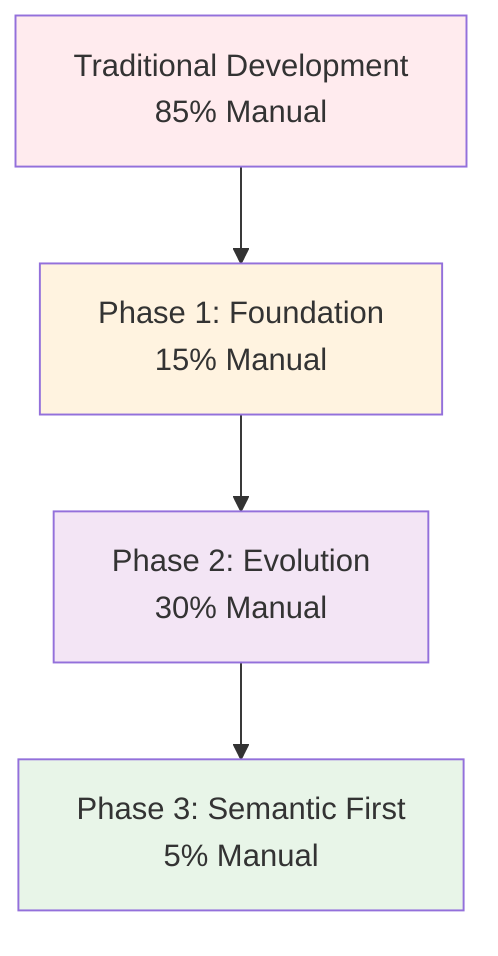
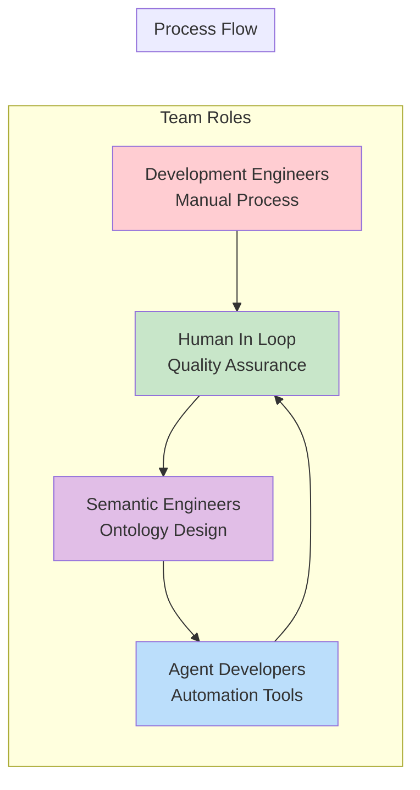
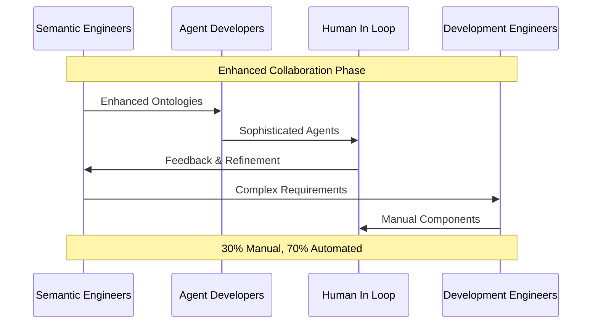
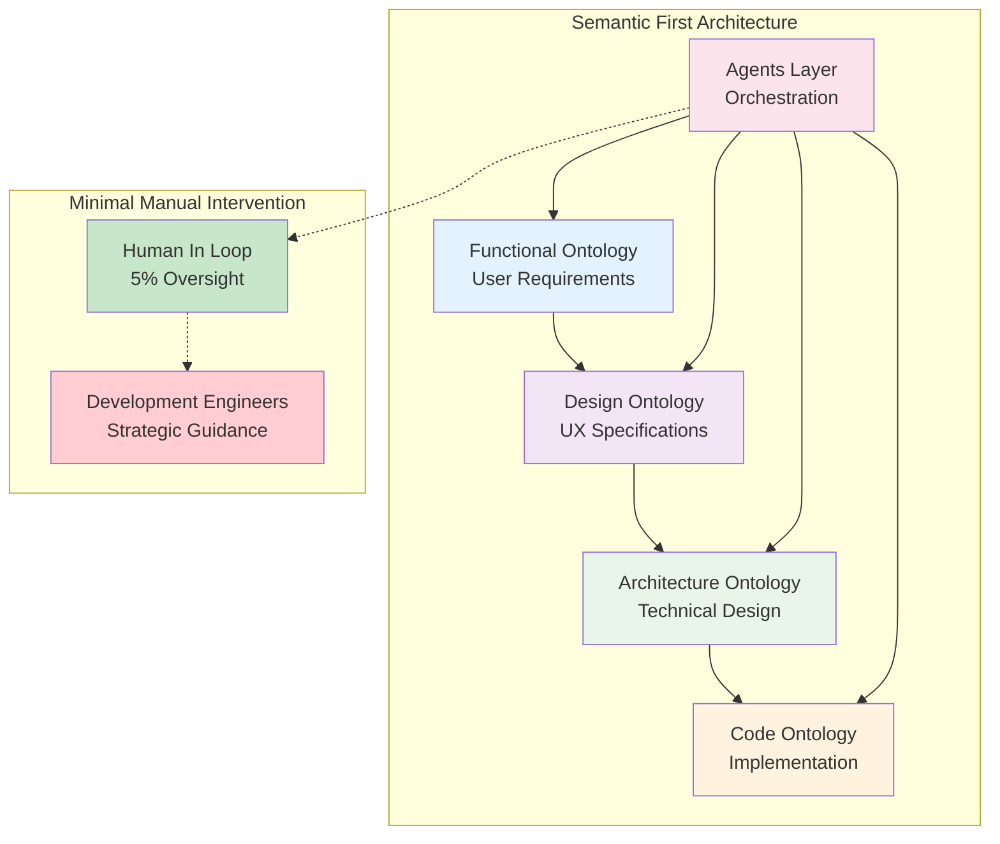
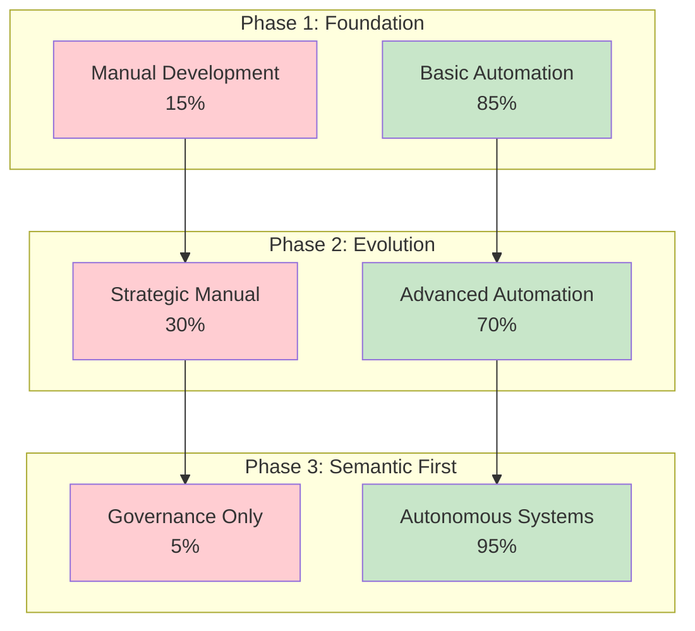
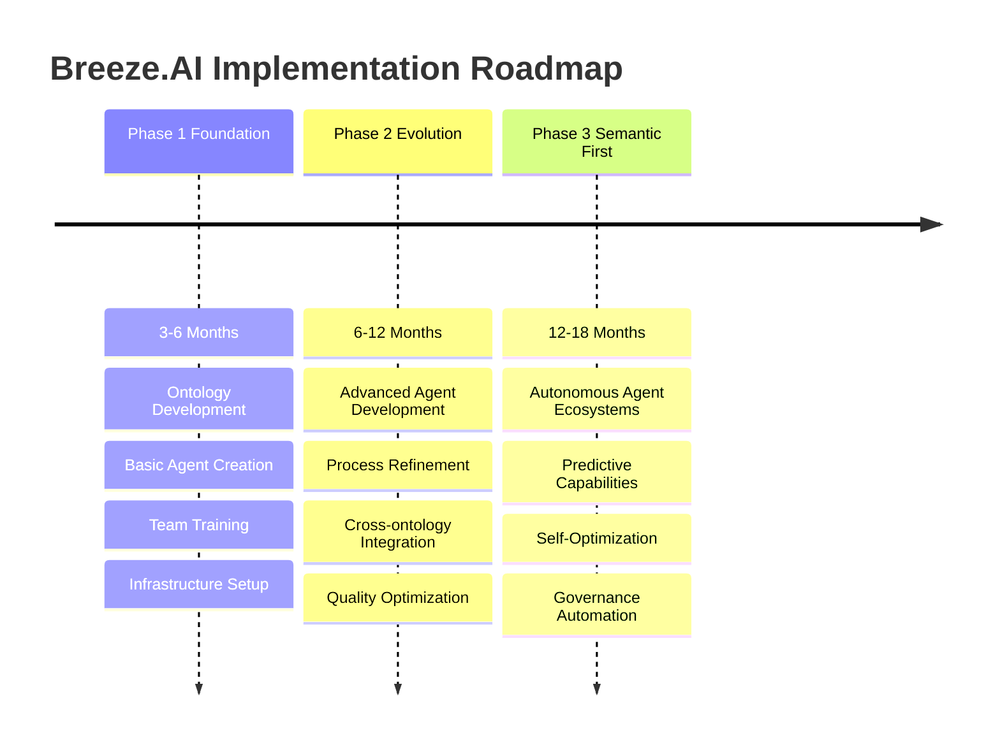
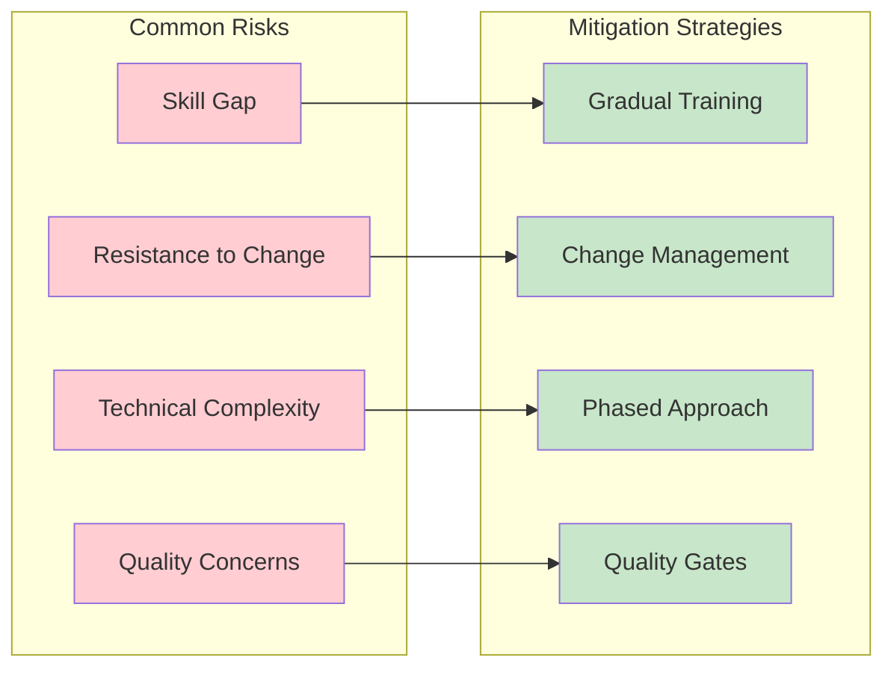

# Breeze.AI Process Flow Methodology

A comprehensive three-phase transformation methodology that transitions software development teams from traditional manual development to semantic engineering, reducing manual work from 85% to just 5% while maintaining quality and control.

## Overview

The Breeze.AI Process Flow represents a structured approach to adopting semantic engineering practices. Rather than attempting an overnight transformation, this methodology provides a gradual transition path that allows teams to adapt their skills, processes, and tooling incrementally.

## The Three-Phase Journey

### Phase 1: Semantic Engineering Foundation (15% Manual)
**Goal**: Establish the foundational infrastructure and processes for semantic engineering

**Key Activities:**
- **Semantic Engineers** create the foundational ontologies (Functional, Design, Architecture, Code)
- **Agent Developers** build basic automation tools and workflows
- **Development Engineers** handle complex edge cases and critical manual tasks
- **Human In Loop** provides quality assurance and validation

**Deliverables:**
- 15% manual development (critical components, complex integrations)
- 85% semantic engineering output (automated generation, testing, deployment)

### Phase 2: Semantic Engineering Evolution (30% Manual)
**Goal**: Expand semantic capabilities and refine agent orchestration

**Key Improvements:**
- More sophisticated agent interactions
- Enhanced cross-ontology relationships
- Improved error handling and edge case management
- Expanded automation coverage

**Process Characteristics:**
- **Iterative Refinement**: Continuous improvement of semantic models
- **Agent Sophistication**: More complex autonomous decision-making
- **Quality Enhancement**: Improved validation and testing processes

### Phase 3: Semantic First Engineering (5% Manual)
**Goal**: Achieve near-complete automation with semantic-driven development

**Advanced Capabilities:**
- **Autonomous Agent Ecosystems**: Agents that can self-organize and adapt
- **Semantic Governance**: Automatic compliance and quality assurance
- **Predictive Development**: Anticipating user needs and technical requirements
- **Self-Optimizing Systems**: Continuous improvement without human intervention

## Team Evolution Across Phases

```mermaid
gantt
    title Team Role Evolution Across Phases
    dateFormat X
    axisFormat %s
    
    section Phase 1
    Development Engineers (Manual)    :done, de1, 0, 15
    Human In Loop (QA)               :done, hil1, 0, 85
    Semantic Engineers (Design)       :done, se1, 0, 85
    Agent Developers (Tools)          :done, ad1, 0, 85
    
    section Phase 2  
    Development Engineers (Reduced)   :active, de2, 15, 30
    Human In Loop (Enhanced)          :active, hil2, 15, 70
    Semantic Engineers (Advanced)     :active, se2, 15, 70
    Agent Developers (Sophisticated)  :active, ad2, 15, 70
    
    section Phase 3
    Development Engineers (Strategic) :se3, 30, 5
    Human In Loop (Oversight)         :se3, 30, 95
    Semantic Engineers (Governance)   :se3, 30, 95
    Agent Developers (Ecosystem)      :se3, 30, 95
```

## Process Outputs by Phase

### Phase 1 Outputs
- **Manual Process (15%)**: Critical business logic, complex integrations
- **Semantic Engineering (85%)**: Basic CRUD operations, standard workflows, testing automation

### Phase 2 Outputs  
- **Manual Process (30%)**: Strategic decisions, complex problem-solving
- **Semantic Engineering (70%)**: Advanced workflows, sophisticated integrations, predictive capabilities

### Phase 3 Outputs
- **Manual Process (5%)**: High-level strategy, governance oversight
- **Semantic Engineering (95%)**: End-to-end automation, self-optimizing systems, autonomous development

## Technical Architecture Evolution

## Implementation Timeline

## Success Metrics

### Quantitative Measures
- **Manual Work Reduction**: 85% → 15% → 30% → 5%
- **Development Velocity**: 3-5x increase by Phase 3
- **Quality Metrics**: 90%+ automated test coverage
- **Time to Market**: 60-80% reduction in delivery cycles

### Qualitative Indicators
- **Team Satisfaction**: Reduced repetitive work, focus on strategic thinking
- **Innovation Capacity**: More time for creative problem-solving
- **System Reliability**: Predictable, consistent outputs
- **Adaptability**: Rapid response to changing requirements

## Risk Mitigation

## Conclusion

The Breeze.AI Process Flow methodology provides a structured path for organizations to transition from traditional software development to semantic engineering. By following this three-phase approach, teams can:

1. **Minimize Risk**: Gradual transition with continuous validation
2. **Maximize Learning**: Each phase builds on previous knowledge
3. **Maintain Quality**: Human oversight ensures standards are met
4. **Achieve Scale**: Progressive automation increases efficiency

The end result is a transformed development organization capable of delivering software at unprecedented speed and quality while freeing human talent to focus on strategic, creative, and high-value activities.

---

*This methodology is part of the broader Breeze.AI framework for semantic engineering transformation. For more details on the underlying ontologies and technical architecture, see the companion documentation in this repository.*