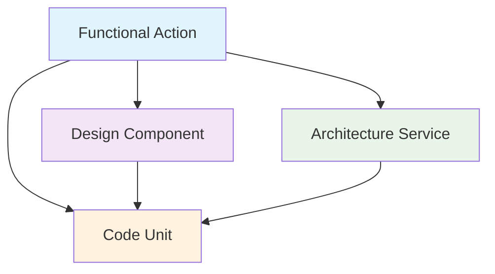

# Software Engineering Ontology Framework

## Overview

This framework defines four distinct but interconnected ontologies for comprehensive software engineering governance across application portfolios. Each ontology operates independently while maintaining structured relationships with others, enabling strategic initiatives like application modernization, portfolio rationalization, and greenfield development.

## Core Principles

- **Functional Ontology**: Modality-agnostic representation of user needs and behaviors
- **Design Ontology**: Physical implementation of user experience for specific modalities
- **Architecture Ontology**: Logical technical design - services, layers, and system organization patterns
- **Code Ontology**: Physical implementation units - actual executable code that realizes architecture and functionality
- **Cross-Ontology Relationships**: Formal mappings enabling traceability and governance
- **Independence**: Physical ontologies can connect to functional nodes both directly and through other ontologies, enabling governance analytics

---

## 1. Functional Ontology

### Structure

```
Functional Ontology (Modality-Agnostic)
├── Persona (user archetypes)
    ├── Outcomes (desired end results)
        ├── Scenarios (specific use cases)
            ├── Steps (logical progression)
                └── Actions (atomic user intentions)
```

### Definitions

|Level|Definition|Example|
|---|---|---|
|**Persona**|Distinct user archetype with specific needs, goals, and contexts|"E-commerce Shopper", "System Administrator", "API Consumer"|
|**Outcomes**|High-level goals the persona wants to achieve|"Complete Purchase", "Monitor System Health", "Retrieve Product Data"|
|**Scenarios**|Specific use cases within an outcome|"Buy Gift for Friend", "Investigate Performance Alert", "Bulk Product Sync"|
|**Steps**|Logical progression of activities in a scenario|"Search Products", "Review Options", "Make Decision"|
|**Actions**|Atomic user intentions that drive interactions|"Enter Search Term", "Filter Results", "Compare Items"|

---

## 2. Design Ontology

### Structure

```
Design Ontology (Physical UX Implementation)
├── User Journeys (multi-session, cross-application flows)
    ├── Flows (single-session, multi-page sequences)
        ├── Pages (complete screen/interface units)
            ├── Templates (page-level layout patterns)
                ├── Organisms (complex component groups)
                    ├── Molecules (simple component combinations)
                        └── Atoms (individual interface elements)
```

### Definitions

|Level|Definition|Example|
|---|---|---|
|**User Journeys**|Multi-session experiences spanning multiple applications or extended time periods|"Customer Lifecycle Journey", "Employee Onboarding Journey"|
|**Flows**|Single-session sequences connecting multiple pages or interfaces|"Registration Flow", "Checkout Flow", "Data Import Flow"|
|**Pages**|Complete screen or interface units representing discrete interaction contexts|"Product Listing Page", "User Profile Page", "API Response Schema"|
|**Templates**|Reusable page-level layout patterns|"List Template", "Detail Template", "Dashboard Template"|
|**Organisms**|Complex component groups with specific functionality|"Navigation Header", "Product Grid", "Data Table"|
|**Molecules**|Simple combinations of atoms with single purpose|"Search Box", "Product Card", "Form Field Group"|
|**Atoms**|Individual interface elements that cannot be broken down further|"Button", "Input Field", "Label", "JSON Field"|

---

## 3. Architecture Ontology

### Structure

```
Architecture Ontology (Logical Technical Design)
├── Layers (8-tier architecture)
    ├── User Experience
    ├── API Gateway
    ├── Observability & Monitoring
    ├── Agents (intelligent orchestration)
        ├── Business Process Agents (end-to-end workflows)
        ├── Domain Agents (specialized capabilities)
        ├── Integration Agents (external system coordination)
        └── Assistant Agents (user interaction support)
    ├── Services
        ├── Custom Services
            ├── Entity Services (domain objects)
            ├── Workflow Services (business processes)
            └── Integration Services (external systems)
        ├── Platform Services (shared capabilities)
            ├── Authentication
            ├── Search
            └── Notifications
    ├── Event Queue
    ├── Data Lake, Analytics, AI/ML
        ├── Ingestion & Transformation
        ├── Models and Management
        ├── Semantic
        └── Reporting & Analytics
    └── Infrastructure
```

### Definitions

|Level|Definition|Example|
|---|---|---|
|**Layers**|Logical separation of concerns in system architecture|"User Experience Layer", "Agents Layer", "Services Layer", "Data Layer"|
|**Service Types**|Categories of services based on their architectural role|"Agents", "Platform Services", "Custom Services", "Integration Services"|
|**Services**|Logical business or technical capabilities with defined boundaries|"Order Processing Agent", "Product Catalog Service", "Payment Processing Service"|
|**Entities/Components**|Architectural building blocks within services - agents, microservices, microfrontends, data schemas|"Purchase Completion Agent", "Product Catalog Microfrontend", "User Authentication Microservice"|

### Agents Layer Deep Dive

#### Agent Types and Responsibilities

|Agent Type|Purpose|Capabilities|Example Agents|
|---|---|---|---|
|**Business Process Agents**|Orchestrate complete end-to-end business workflows|Multi-step coordination, decision making, exception handling|Purchase Completion Agent, Customer Onboarding Agent, Incident Response Agent|
|**Domain Agents**|Provide specialized intelligence within specific domains|Domain expertise, optimization, pattern recognition|Product Discovery Agent, System Optimization Agent, Risk Assessment Agent|
|**Integration Agents**|Coordinate interactions with external systems|Protocol translation, error recovery, data transformation|External System Integration Agent, Partner API Agent, Legacy System Bridge Agent|
|**Assistant Agents**|Support user interactions and queries|Natural language processing, context understanding, task guidance|Customer Support Agent, Operations Assistant Agent, Developer Helper Agent|

#### Agent Orchestration Patterns

**Service Coordination Flow:**

```
User Request → Agent Layer → Service Orchestration → Response Assembly

Example: "Complete my order for the red shoes"
1. Purchase Completion Agent receives request
2. Coordinates: Product Service + Inventory Service + Payment Service + Shipping Service
3. Handles: Stock validation, payment processing, shipping calculation
4. Returns: Complete order confirmation with tracking info
```

**Agent Collaboration:**

```
Complex Request → Multiple Agents → Coordinated Response

Example: "Find and order the best running shoes for my marathon training"
1. Product Discovery Agent: Analyzes preferences, finds recommendations
2. Purchase Completion Agent: Handles order processing
3. Customer Support Agent: Provides training advice and order support
```

#### Benefits of Agents Layer

1. **Intelligent Orchestration**: Agents can make decisions about which services to call and in what order
2. **User Experience Enhancement**: Complex multi-step processes appear as simple single interactions
3. **Autonomous Problem Solving**: Agents can handle exceptions and edge cases without user intervention
4. **Context Preservation**: Agents maintain conversation and task context across multiple service calls
5. **Business Logic Abstraction**: Complex business rules are encapsulated in agents rather than scattered across services
6. **Adaptive Behavior**: Agents can learn and optimize their orchestration patterns over time

**Note**: Architecture Ontology defines the logical design and service boundaries, including intelligent agents that orchestrate services. The Agents layer provides intelligent coordination between the User Experience layer and Services layer, enabling autonomous task completion and complex workflow orchestration. Code Ontology represents the actual implementation of these architectural concepts.

---

## 4. Code Ontology

### Structure

```
Code Ontology (Physical Implementation Units)
├── Frontend Code
│   ├── Applications (deployable frontend units)
│   ├── Modules (logical feature groupings)
│   ├── Components (UI implementation units)
│   ├── Functions/Hooks (executable UI logic)
│   ├── Properties/State (UI data units)
│   └── Configurations (frontend settings)
├── Backend Code
│   ├── Applications (deployable backend units)
│   ├── Modules (business domain groupings)
│   ├── Classes/Services (business logic units)
│   ├── Functions/Methods (executable operations)
│   ├── Properties/Fields (data units)
│   └── Configurations (backend settings)
└── Data Code
    ├── Applications (data processing units)
    ├── Modules (data domain groupings)
    ├── Classes/Processors (data transformation units)
    ├── Functions/Queries (data operations)
    ├── Properties/Schemas (data structure definitions)
    └── Configurations (data settings)
```

### Base Ontology Definitions

#### Frontend Code Base Ontology

|Level|Definition|Example|
|---|---|---|
|**Applications**|Independently deployable frontend units|"E-commerce Web App", "Admin Dashboard SPA", "Mobile App"|
|**Modules**|Logical feature groupings within frontend applications|"ProductModule", "UserModule", "CartModule"|
|**Components**|UI implementation units (pages, components, layouts)|"ProductCard", "LoginForm", "NavigationHeader"|
|**Functions/Hooks**|Executable UI logic and state management|"useProductData()", "handleSubmit()", "validateForm()"|
|**Properties/State**|UI data units and component properties|"isLoading", "userInput", "selectedItems[]"|
|**Configurations**|Frontend deployment and runtime settings|"webpack.config", "environment.json", "routing.config"|

#### Backend Code Base Ontology

|Level|Definition|Example|
|---|---|---|
|**Applications**|Independently deployable backend units|"Product API Service", "User Management Service", "Payment Gateway"|
|**Modules**|Business domain groupings within backend applications|"ProductModule", "OrderModule", "PaymentModule"|
|**Classes/Services**|Business logic and service implementation units|"ProductService", "OrderController", "PaymentProcessor"|
|**Functions/Methods**|Executable business operations and API endpoints|"createProduct()", "processPayment()", "GET /api/orders"|
|**Properties/Fields**|Data units and configuration values|"productId", "orderTotal", "apiEndpoints"|
|**Configurations**|Backend deployment and runtime settings|"database.config", "service.yaml", "security.properties"|

#### Data Code Base Ontology

|Level|Definition|Example|
|---|---|---|
|**Applications**|Data processing and pipeline units|"ETL Pipeline", "Analytics Engine", "Data Sync Service"|
|**Modules**|Data domain groupings|"CustomerDataModule", "ProductDataModule", "AnalyticsModule"|
|**Classes/Processors**|Data transformation and processing units|"DataValidator", "SchemaMapper", "AnalyticsProcessor"|
|**Functions/Queries**|Data operations and transformations|"transformProduct()", "validateSchema()", "SELECT * FROM products"|
|**Properties/Schemas**|Data structure definitions and metadata|"productSchema", "customerFields", "analyticsMetrics"|
|**Configurations**|Data processing and storage settings|"pipeline.yaml", "schema.json", "database.properties"|

### Technology-Specific Sub-Ontologies

#### Frontend Technology Stacks

**React/TypeScript Stack**

- **Applications**: Create React App, Next.js App, Micro-frontend
- **Modules**: Feature modules, Shared component libraries
- **Components**: React Components, Custom Hooks, Context Providers
- **Functions/Hooks**: Event handlers, useEffect, useState, Custom hooks
- **Properties/State**: Props, State variables, Context values
- **Configurations**: package.json, tsconfig.json, webpack.config.js

**Vue.js Stack**

- **Applications**: Vue CLI App, Nuxt.js App, Vue Micro-frontend
- **Modules**: Vue modules, Plugin libraries
- **Components**: Vue Components, Composables, Directives
- **Functions/Hooks**: Methods, Computed properties, Watchers
- **Properties/State**: Data properties, Props, Store state
- **Configurations**: vue.config.js, nuxt.config.js, package.json

**Mobile (React Native/Flutter)**

- **Applications**: React Native App, Flutter App, Expo App
- **Modules**: Platform-specific modules, Native modules
- **Components**: Screen Components, Native Components, Platform widgets
- **Functions/Hooks**: Navigation handlers, Platform API calls, Lifecycle methods
- **Properties/State**: Screen state, Device capabilities, Platform properties
- **Configurations**: metro.config.js, pubspec.yaml, app.json

#### Backend Technology Stacks

**Node.js/Express Stack**

- **Applications**: Express Server, Serverless Functions, Microservices
- **Modules**: Route modules, Middleware modules, Business logic modules
- **Classes/Services**: Controllers, Services, Repositories, Middleware
- **Functions/Methods**: Route handlers, Business logic methods, Database operations
- **Properties/Fields**: Request/Response objects, Configuration variables, Constants
- **Configurations**: package.json, .env files, server.config.js

**Java/Spring Stack**

- **Applications**: Spring Boot Apps, Microservices, WAR deployments
- **Modules**: Spring modules, Maven/Gradle modules
- **Classes/Services**: Controllers, Services, Repositories, Configurations
- **Functions/Methods**: REST endpoints, Service methods, Repository operations
- **Properties/Fields**: Entity fields, Configuration properties, Constants
- **Configurations**: application.properties, pom.xml, application.yml

**Python/Django Stack**

- **Applications**: Django Apps, FastAPI Services, Flask Applications
- **Modules**: Django apps, Python packages, Blueprint modules
- **Classes/Services**: Views, Models, Serializers, Services
- **Functions/Methods**: View functions, Model methods, API endpoints
- **Properties/Fields**: Model fields, Configuration variables, Constants
- **Configurations**: settings.py, requirements.txt, wsgi.py

#### Data Technology Stacks

**SQL Database Stack**

- **Applications**: Database instances, Data warehouses, OLAP systems
- **Modules**: Database schemas, Table groups, Stored procedure modules
- **Classes/Processors**: Tables, Views, Stored procedures, Functions
- **Functions/Queries**: SQL queries, Stored procedures, Triggers
- **Properties/Schemas**: Column definitions, Constraints, Indexes
- **Configurations**: Database.ini, Connection strings, Schema definitions

**NoSQL Database Stack**

- **Applications**: MongoDB clusters, Redis instances, Elasticsearch clusters
- **Modules**: Database collections, Index groups, Pipeline modules
- **Classes/Processors**: Collections, Documents, Aggregation pipelines
- **Functions/Queries**: Aggregations, Map-reduce functions, Search queries
- **Properties/Schemas**: Document schemas, Field mappings, Index definitions
- **Configurations**: mongod.conf, redis.conf, elasticsearch.yml

**Data Pipeline Stack**

- **Applications**: Apache Airflow, Apache Kafka, ETL platforms
- **Modules**: DAG modules, Pipeline stages, Processing modules
- **Classes/Processors**: DAGs, Operators, Processors, Transformers
- **Functions/Queries**: Task functions, Stream processors, Data transformations
- **Properties/Schemas**: Pipeline configurations, Data schemas, Transformation rules
- **Configurations**: airflow.cfg, pipeline.yaml, kafka.properties

**Note**: Code Ontology represents the actual physical implementation units organized by frontend, backend, and data concerns, with technology-specific implementations that realize the logical concepts defined in the Architecture Ontology.

---

## Example Application Graphs for the Ontologies

### Example 1: E-commerce Product Purchase

#### Functional Graph

|Persona|Outcome|Scenario|Steps|Actions|
|---|---|---|---|---|
|E-commerce Shopper|Complete Purchase|Buy Gift for Friend|Search Products|Enter Search Term|
|||||Apply Category Filter|
||||Review Options|View Product Details|
|||||Compare Products|
|||||Read Reviews|
||||Make Decision|Add to Cart|
|||||Proceed to Checkout|
||||Complete Transaction|Enter Shipping Info|
|||||Enter Payment Info|
|||||Confirm Purchase|

#### Design Graph (Web Modality)

|User Journey|Flow|Page|Template|Organism|Molecule|Atom|
|---|---|---|---|---|---|---|
|Shopping Experience|Product Discovery Flow|Search Results Page|List Template|Product Grid|Product Card|Product Image|
|||||||Product Title|
|||||||Price Display|
|||Product Detail Page|Detail Template|Product Info Panel|Image Gallery|Image Thumbnail|
||||||Add to Cart Section|Add to Cart Button|
||||||Reviews Panel|Star Rating|
||Purchase Flow|Shopping Cart Page|Form Template|Cart Summary|Cart Item|Quantity Input|
|||||||Remove Button|
|||Checkout Page|Form Template|Payment Form|Credit Card Group|Card Number Input|
|||||||CVV Input|

#### Architecture Graph

|Layer|Service Type|Service|Entity/Component|
|---|---|---|---|
|User Experience|Frontend|E-commerce Web Frontend|Product Catalog Microfrontend, Shopping Cart Microfrontend, User Account Microfrontend|
|API Gateway|Gateway|Customer API Gateway|Route Management, Load Balancing, Rate Limiting|
|Agents|Business Process Agents|Purchase Completion Agent|Order Orchestration, Payment Coordination, Inventory Reservation|
||Domain Agents|Product Discovery Agent|Search Optimization, Recommendation Generation, Personalization|
||Assistant Agents|Customer Support Agent|Query Understanding, Solution Matching, Escalation Management|
|Services|Custom Services|Product Catalog Service|Product Entity, Category Entity, Inventory Entity|
|||Order Management Service|Cart Management, Order Processing, Order History|
|||Payment Processing Service|Payment Gateway Integration, Transaction Management|
||Platform Services|Identity & Access Service|User Authentication, Session Management, Authorization|
|||Search & Discovery Service|Product Search, Recommendation Engine, Personalization|
|Data Lake|Semantic|Customer Data Schema|Product Catalog Schema, Order Transaction Schema|
|||Analytics Schema|User Behavior Schema, Sales Performance Schema|

#### Code Graph (React/TypeScript Frontend)

|Application|Module|Component|Function/Hook|Property/State|Configuration|
|---|---|---|---|---|---|
|E-commerce Web App|ProductModule|ProductCard|renderProductCard()|product.id|api.endpoints|
|||||product.name||
|||||product.price||
|||SearchComponent|handleSearchInput()|searchTerm||
||||executeSearch()|searchResults[]||
||CartModule|CartService|addToCart()|cartItems[]|feature.flags|
||||calculateTotal()|totalPrice||
|||CheckoutComponent|handlePayment()|paymentData|payment.config|
||||validateForm()|formErrors[]||

#### Code Graph (Node.js Backend)

|Application|Module|Class/Service|Function/Method|Property/Field|Configuration|
|---|---|---|---|---|---|
|Product API Service|ProductModule|ProductService|getProductById()|productId|database.config|
||||searchProducts()|searchCriteria||
|||ProductRepository|findById()|product.sku||
||||save()|product.inventory||
||CartModule|CartService|addItem()|cartId|redis.config|
||||removeItem()|userId||
|||CartController|POST /cart/items|request.body|api.routes|
||||DELETE /cart/items|response.status||

### Example 2: System Administration - Monitor Application Health

#### Functional Graph

|Persona|Outcome|Scenario|Steps|Actions|
|---|---|---|---|---|
|System Administrator|Monitor System Health|Investigate Performance Alert|Receive Alert|View Alert Notification|
|||||Navigate to Dashboard|
||||Analyze Metrics|Review CPU Metrics|
|||||Check Memory Usage|
|||||Examine Network Traffic|
||||Diagnose Issue|Filter by Time Range|
|||||Drill Down to Service|
|||||View Error Logs|
||||Take Action|Restart Service|
|||||Scale Resources|
|||||Create Incident Ticket|

#### Design Graph (Dashboard Modality)

|User Journey|Flow|Page|Template|Organism|Molecule|Atom|
|---|---|---|---|---|---|---|
|System Management Journey|Alert Investigation Flow|Alerts Dashboard|Dashboard Template|Alert Panel|Alert Card|Alert Icon|
|||||||Alert Message|
|||||||Timestamp|
|||Metrics Dashboard|Dashboard Template|Metrics Grid|Metric Widget|Chart Canvas|
|||||||Value Display|
|||||||Trend Indicator|
|||Service Detail Page|Detail Template|Service Info Panel|Log Viewer|Log Entry|
|||||||Filter Controls|
||Action Flow|Service Control Page|Form Template|Action Panel|Control Button Group|Start Button|
|||||||Stop Button|
|||||||Restart Button|

#### Architecture Graph

|Layer|Service Type|Service|Entity/Component|
|---|---|---|---|
|User Experience|Frontend|Admin Dashboard Frontend|Monitoring Microfrontend, System Control Microfrontend, Analytics Microfrontend|
|API Gateway|Gateway|System Management API Gateway|Service Discovery, Health Check Routing, Admin API Aggregation|
|Event Queue|Message Queue|System Event Queue|Alert Streaming, Metrics Streaming, Audit Log Queue|
|Observability & Monitoring|Monitoring|System Monitoring Service|Metrics Collection, Alert Generation, Health Checking|
|||Log Management Service|Log Aggregation, Log Analysis, Error Tracking|
|||Performance Analytics Service|Performance Metrics, Trend Analysis, Capacity Planning|
|Agents|Business Process Agents|Incident Response Agent|Alert Correlation, Root Cause Analysis, Auto-remediation|
||Domain Agents|System Optimization Agent|Performance Tuning, Resource Scaling, Capacity Planning|
||Assistant Agents|Operations Assistant Agent|Query Interpretation, Command Translation, Status Reporting|
|Services|Custom Services|System Management Service|Server Entity, Service Entity, Application Entity|
|||Incident Management Service|Alert Processing, Escalation Workflows, Resolution Tracking|
||Platform Services|Admin Identity Service|Admin Authentication, Role Management, Audit Logging|
|||System Notification Service|Email Alerts, Slack Integration, SMS Notifications|

#### Code Graph (Vue.js Dashboard Frontend)

|Application|Module|Component|Function/Hook|Property/State|Configuration|
|---|---|---|---|---|---|
|Admin Dashboard App|AlertModule|AlertPanel|displayAlert()|alert.id|websocket.config|
||||formatTimestamp()|alert.severity||
|||AlertService|fetchAlerts()|alertList[]||
||||subscribeToAlerts()|subscription||
||MetricsModule|MetricWidget|renderChart()|chartData[]|chart.config|
||||updateMetrics()|metricValue||
|||MetricsService|getSystemMetrics()|timeRange|monitoring.endpoints|
||||calculateAverages()|averageValue||
||ActionModule|ServiceController|restartService()|serviceId|service.endpoints|
||||scaleResources()|scaleConfig||

#### Code Graph (Python Backend)

|Application|Module|Class/Service|Function/Method|Property/Field|Configuration|
|---|---|---|---|---|---|
|Monitoring API Service|AlertModule|AlertService|create_alert()|alert_id|prometheus.config|
||||process_metrics()|metric_data||
|||AlertRepository|save_alert()|alert.timestamp|database.config|
||||find_by_severity()|alert.message||
||SystemModule|SystemService|get_service_status()|service_name|kubernetes.config|
||||restart_service()|restart_result||
|||SystemController|POST /services/restart|request.json|api.routes|
||||GET /metrics|response.data||

### Example 3: API Integration - Bulk Data Synchronization

#### Functional Graph

|Persona|Outcome|Scenario|Steps|Actions|
|---|---|---|---|---|
|API Consumer (System)|Retrieve Product Data|Bulk Product Sync|Authenticate|Generate API Token|
|||||Validate Credentials|
||||Request Data|Send Bulk Request|
|||||Specify Filters|
|||||Set Pagination|
||||Process Response|Validate Response|
|||||Parse Data|
|||||Handle Errors|
||||Store Data|Transform Format|
|||||Update Local Database|
|||||Log Sync Results|

#### Design Graph (API Modality)

|User Journey|Flow|Page|Template|Organism|Molecule|Atom|
|---|---|---|---|---|---|---|
|Data Integration Journey|Authentication Flow|Token Endpoint|API Template|Auth Response|Token Object|Access Token Field|
|||||||Expiry Field|
|||||||Scope Field|
||Data Retrieval Flow|Products Endpoint|API Template|Product Collection|Product Object|Product ID Field|
|||||||Name Field|
|||||||Price Field|
|||||Pagination Object|Page Number Field||
|||||||Total Count Field|
||Error Handling Flow|Error Response|API Template|Error Object|Error Detail|Error Code Field|
|||||||Error Message Field|
|||||||Timestamp Field|

#### Architecture Graph

|Layer|Service Type|Service|Entity/Component|
|---|---|---|---|
|API Gateway|Gateway|External Integration Gateway|API Authentication, Rate Limiting, Request Routing, Response Transformation|
|Event Queue|Message Queue|Data Synchronization Queue|Batch Job Queue, Error Retry Queue, Dead Letter Queue|
|Agents|Business Process Agents|Data Sync Orchestration Agent|Sync Planning, Conflict Resolution, Quality Assurance|
||Integration Agents|External System Integration Agent|API Translation, Protocol Adaptation, Error Recovery|
||Assistant Agents|Data Integration Assistant Agent|Query Optimization, Schema Mapping, Transformation Logic|
|Services|Custom Services|Product Data Service|Product Entity, Category Entity, Inventory Entity, Pricing Entity|
|||Data Synchronization Service|Batch Processing, Data Validation, Conflict Resolution, Sync Scheduling|
||Platform Services|API Key Management Service|Token Generation, Credential Validation, Access Control|
|||Rate Limiting Service|Throttling Control, Quota Management, Usage Analytics|
|Data Lake|Ingestion & Transformation|ETL Processing Service|Data Validation, Schema Mapping, Data Transformation, Quality Assurance|
||Semantic|Integration Data Schema|API Request Schema, Response Schema, Error Schema, Audit Schema|

#### Code Graph (Node.js API Backend)

|Application|Module|Class/Service|Function/Method|Property/Field|Configuration|
|---|---|---|---|---|---|
|Sync API Service|AuthModule|AuthService|generateToken()|apiKey|jwt.config|
||||validateCredentials()|tokenExpiry||
|||TokenRepository|saveToken()|token.scope|database.config|
||||revokeToken()|token.userId||
||ProductModule|ProductService|getBulkProducts()|productIds[]|pagination.config|
||||applyFilters()|filterCriteria||
|||ProductController|GET /products/bulk|request.query|api.routes|
|||||response.headers||
||SyncModule|SyncService|processBatch()|batchSize|batch.config|
||||validateData()|validationRules||
|||ErrorHandler|handleApiError()|errorCode|error.mappings|
||||logError()|errorMessage||

#### Data Code Graph (ETL Pipeline)

|Application|Module|Class/Processor|Function/Query|Property/Schema|Configuration|
|---|---|---|---|---|---|
|Product Data Pipeline|IngestionModule|DataExtractor|extractFromAPI()|sourceEndpoint|source.config|
||||validateSource()|extractionRules||
||TransformModule|SchemaMapper|mapProductSchema()|productMapping|schema.mapping|
||||normalizeData()|transformRules||
|||DataValidator|validateProducts()|validationSchema|validation.rules|
||LoadModule|DataLoader|loadToWarehouse()|targetSchema|warehouse.config|
||||updateMetadata()|loadStatistics||

---

## Cross-Ontology Relationship Types

### Relationship Categories

|Relationship Type|Description|Example|
|---|---|---|
|**Implements**|Design or Code node realizes Functional node|"Add to Cart Button" implements "Add to Cart Action", "addToCart()" implements "Add to Cart Action"|
|**Supports**|Architecture node enables Design, Code, or Functional capability|"Product Entity Service" supports "Product Display", "ProductRepository" supports "Product Storage"|
|**Requires**|Functional node needs specific Design, Architecture, or Code implementation|"Compare Products Action" requires "Product Comparison Template", requires "compareProducts()"|
|**Triggers**|Functional action initiates Architecture process or Code execution|"Confirm Purchase Action" triggers "Order Workflow Service", triggers "processPayment()"|
|**Validates**|Architecture service or Code unit ensures Functional requirement|"Authentication Service" validates "User Login Action", "validateCredentials()" validates "User Login Action"|
|**Realizes**|Code unit implements Architecture concept|"ProductService.java" realizes "Product Entity Service", "authMiddleware.ts" realizes "Authentication Service"|
|**Renders**|Code unit implements Design concept|"ProductCard.tsx" renders "Product Card Component", "login.vue" renders "Login Form Template"|
|**Composes**|Code units compose into larger units|"renderProductCard()" composes "ProductCard", "ProductCard" composes "ProductModule"|

### Cardinality Patterns

- **One-to-One**: Single Action maps to single Component or Code unit
- **One-to-Many**: Single Action implemented by multiple Components or Code units
- **Many-to-One**: Multiple Actions share same Component or Code unit
- **Many-to-Many**: Complex interactions across multiple dimensions

### Multi-Dimensional Connectivity Model



**Connection Types:**

- **Direct Functional-Code**: Immediate traceability for analysis
- **Functional-Design-Code**: UI governance path
- **Functional-Architecture-Code**: Service governance path
- **Cross-validation**: Compare all paths for consistency

---

## Governance Analytics and Consistency Metrics

### Architecture Consistency Metrics

#### Service Alignment Analysis

|Metric|Description|Formula|Governance Insight|
|---|---|---|---|
|**Architecture Adherence**|% of Code units that properly realize Architecture services|(Code units with Architecture mapping / Total Code units) × 100|Identifies architectural drift|
|**Service Implementation Gap**|Architecture services without Code implementations|Count of unmapped Architecture services|Highlights incomplete implementations|
|**Direct Implementation Bypass**|Code units implementing Functional actions without Architecture services|Count of Functional→Code without Architecture path|Detects architecture violations|
|**Service Fragmentation**|Multiple Code implementations per Architecture service|Average Code units per Architecture service|Indicates over-implementation|

#### Architecture Governance Dashboard

```
Service Layer Health:
├── Authentication Service: 95% adherence (19/20 apps)
├── Product Entity Service: 78% adherence (14/18 apps) ⚠️
├── Payment Service: 100% adherence (8/8 apps)
└── Search Service: 65% adherence (13/20 apps) 🚨

Architectural Debt:
├── Bypass Implementations: 23 Code units
├── Orphaned Services: 5 Architecture services  
├── Missing Services: 12 Functional areas
└── Fragmentation Score: 2.3 avg implementations/service
```

### Design Consistency Metrics

#### UI Pattern Adherence Analysis

|Metric|Description|Formula|Governance Insight|
|---|---|---|---|
|**Design System Compliance**|% of Code units that render approved Design components|(Code units with Design mapping / UI Code units) × 100|Measures UX consistency|
|**Pattern Fragmentation**|Different Design implementations per Functional action|Count of Design patterns per Functional action|Identifies UX inconsistencies|
|**Rogue Implementations**|Code units bypassing Design system|Count of UI Code without Design mapping|Detects design violations|
|**Component Utilization**|% of Design components actually implemented|(Implemented Design components / Total Design components) × 100|Shows design system adoption|

#### Design Governance Dashboard

```
Design System Health:
├── Login Patterns: 4 variants across portfolio (Target: 1) 🚨
├── Data Tables: 85% using standard component
├── Form Validation: 92% design compliance
└── Navigation: 3 patterns (Target: 2 for responsive) ⚠️

UX Consistency Score: 78/100
├── Authentication Flow: 95/100
├── Data Display: 85/100  
├── Form Interactions: 92/100
└── Navigation: 45/100 🚨
```

### Cross-Ontology Consistency Analysis

#### Governance Pathway Validation

|Analysis Type|Description|Detection Method|Action Required|
|---|---|---|---|
|**Complete Pathway**|Functional→Design→Code and Functional→Architecture→Code both exist|Cross-reference all mappings|✅ Best practice|
|**Design Bypass**|Functional→Architecture→Code exists but no Design mapping|Missing Design relationships|Create Design patterns|
|**Architecture Bypass**|Functional→Design→Code exists but no Architecture mapping|Missing Architecture relationships|Define service layer|
|**Orphaned Code**|Code exists without any Functional mapping|Unmapped Code units|Remove or map to function|
|**Conflicting Paths**|Different Code units for same Functional action via different paths|Multiple implementation paths|Consolidate implementations|

#### Governance Metrics Dashboard

```
Portfolio Governance Health: 82/100

Pathway Completeness:
├── Complete Pathways: 78% of Functional actions
├── Design Bypasses: 12% of implementations  
├── Architecture Bypasses: 8% of implementations
├── Orphaned Code: 156 units (5% of codebase)
└── Conflicting Paths: 23 Functional actions

Consistency Scores by Application:
├── CustomerPortal: 45/100 (Legacy issues) 🚨
├── SupportDesk: 92/100 (Modern React)
├── PartnerHub: 78/100 (Some bypasses) ⚠️
├── MobileApp: 83/100 (Architecture gaps) ⚠️  
└── AdminConsole: 88/100 (Minor design issues)
```

## Completeness and Equivalence Analysis

### Functional Coverage Metrics

#### Implementation Coverage

|Metric|Description|Formula|Purpose|
|---|---|---|---|
|**Action Coverage**|Percentage of Functional Actions with implementing Code units|(Actions with Code / Total Actions) × 100|Identify missing implementations|
|**Design-Code Alignment**|Percentage of Design Components with corresponding Code units|(Design Components with Code / Total Components) × 100|Ensure design-code consistency|
|**Architecture Utilization**|Percentage of Architecture Services actively used by Code|(Services with Code / Total Services) × 100|Identify unused architecture|

#### Cross-Application Equivalence

|Metric|Description|Formula|Purpose|
|---|---|---|---|
|**Functional Parity**|Percentage of shared Functional Actions across applications|(Shared Actions / Total Unique Actions) × 100|Compare feature completeness|
|**Implementation Diversity**|Number of different Code patterns for same Functional Action|Count of unique implementations per Action|Identify optimization opportunities|
|**Reuse Potential**|Percentage of Code units that could be shared across applications|(Shareable Code Units / Total Code Units) × 100|Portfolio rationalization planning|

### Equivalence Evaluation Framework

#### Cross-Modal Comparison

```
For each Functional Action:
1. Identify implementing Code units in each modality
2. Compare implementation complexity (lines of code, dependencies)
3. Assess functional completeness (error handling, edge cases)
4. Evaluate performance characteristics
5. Check accessibility and usability compliance
```

#### Portfolio Health Dashboard

```
Application A vs Application B:
- Shared Functional Actions: 85%
- Implementation Consistency: 72%
- Code Reuse Opportunities: 23%
- Architecture Alignment: 91%
- Technical Debt Ratio: 15%
```

---

## Governance Applications

### Application Modernization

- **Functional Preservation**: Maintain all Functional mappings while updating Design/Architecture/Code
- **Technology Migration**: Replace Architecture services and Code implementations while preserving Functional-Design relationships
- **UX Refresh**: Update Design ontology and corresponding Code while maintaining Functional and Architecture mappings
- **Code Refactoring**: Restructure Code ontology while maintaining Functional relationships and Architecture dependencies

### Portfolio Rationalization

- **Redundancy Analysis**: Identify duplicate Functional implementations across applications using Code pattern analysis
- **Consolidation Planning**: Merge similar Functional patterns into shared Code libraries and services
- **Feature Comparison**: Compare Functional coverage across portfolio applications through Code analysis
- **Technical Debt Assessment**: Identify Code units with high complexity-to-function ratios

### Cross-Modal Consistency

- **Functional Equivalence**: Ensure same Functional ontology maps to equivalent Code implementations across modalities
- **Service Reuse**: Share Architecture services and Code libraries across different Design implementations
- **Experience Parity**: Maintain feature consistency through standardized Code patterns across web, mobile, and API interfaces
- **Performance Optimization**: Compare Code efficiency across different implementations of same Functional Actions

### Code Quality Governance

- **Implementation Standards**: Ensure Code units follow established patterns for similar Functional Actions
- **Complexity Management**: Monitor Code complexity relative to Functional scope
- **Dependency Tracking**: Map Code dependencies to Architecture services and shared libraries
- **Test Coverage**: Ensure Code units have appropriate test coverage for their Functional responsibilities
- **Consistency Monitoring**: Automated alerts for governance violations and architectural drift

---

## Implementation Considerations

### Formal Ontology Tools

- Machine-readable format for automated analysis
- Version control for ontology evolution
- Validation rules for relationship integrity
- Query capabilities for portfolio analysis
- Code analysis integration for automated mapping
- Continuous integration pipeline for ontology compliance

### Governance Framework

- Change approval process for ontology modifications
- Impact analysis for cross-ontology updates
- Compliance checking for new implementations
- Portfolio health monitoring and reporting
- Code quality gates tied to Functional requirements
- Automated detection of Functional-Code misalignment

### Scalability Factors

- Granularity balance for practical usability
- Maintenance overhead considerations
- Tool integration requirements (IDEs, CI/CD, monitoring)
- Team adoption and training needs
- Automated Code parsing and classification
- Real-time ontology synchronization across development lifecycle